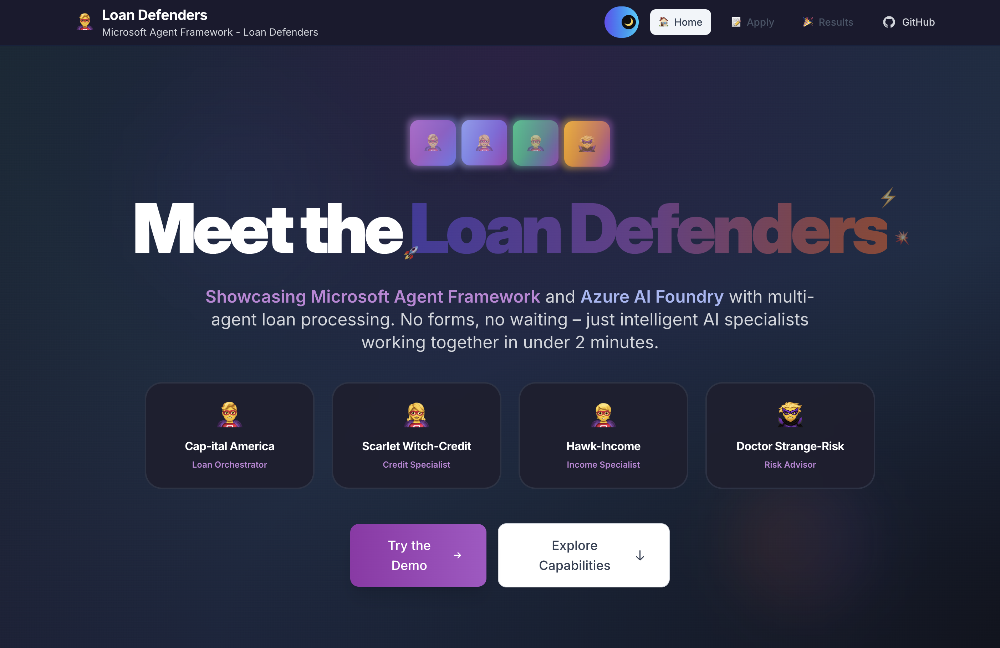
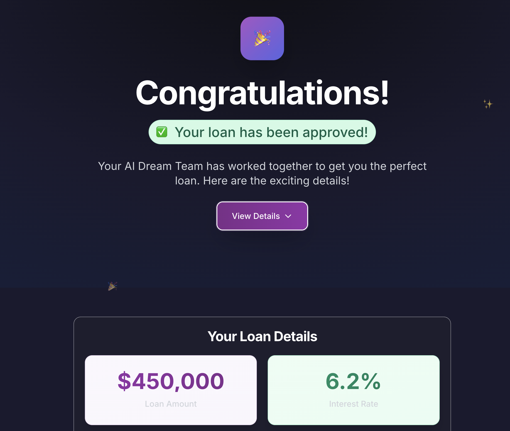

# 🦸‍♂️ The Loan Defenders

[](https://github.com/niksacdev/loan-defenders/actions/workflows/test-apps.yml)
[](https://niksacdev.github.io/loan-defenders/)
[](https://www.python.org/downloads/)
[](LICENSE)
[](https://github.com/astral-sh/ruff)

A multi-agent loan processing system built that transforms traditional loan applications into a conversational experience using personality-driven AI agents.

> **📚 For complete documentation, guides, and API reference, visit [niksacdev.github.io/loan-defenders](https://niksacdev.github.io/loan-defenders/)**

> **⚠️ Experimental Application**: This is a sample demonstrating **[Microsoft Agent Framework](https://github.com/microsoft/agent-framework)** and **[Azure AI Foundry](https://learn.microsoft.com/en-us/azure/ai-studio/)** capabilities through a practical multi-agent loan processing scenario. It highlights AI agent architecture patterns, secure cloud deployment, and AI-augmented agent development practices.

## 🎨 **Experience the Demo**

### Landing Page - Meet Your AI Dream Team

*The home page introduces the AI Dream Team of specialized loan processing agents*

### Live Agent Workflow - Watch the Magic Happen

*Real-time agent coordination as each specialist processes your application*

### Instant Results - Loan Approved! 🎉

*Complete loan decision with full transparency and agent recommendations*
## 🎬 **How It Works**

### **The Defenders Assembly Sequence**
```
User: "I need 250K for this house I'm looking at"

🦸‍♂️ Cap-ital America: "That's exciting! Let me get my team to help you.
                      DEFENDERS, ASSEMBLE! 🦅"

🦸‍♂️ Cap-ital America: [Streaming] "Eagle eyes engaged! 🦅 Scanning application data..."
🦸‍♂️ Cap-ital America: [Streaming] "Everything looks sharp! No missing pieces!"
🦸‍♂️ Cap-ital America: "Perfect! Specialists, this application is pristine - take it away!"

💼 Hawk-Income: "Thanks! I see you're crushing it with your $85k income!
                Let me verify those amazing earnings..."

📊 Scarlet Witch-Credit: "Hawk-Income shared great news about your income stability!
                         Your credit score is opening doors - let me show you what's possible!"

🛡️ Doctor Strange-Risk: "Scarlet Witch-Credit found solid credit strength! This loan fits well
                        with your financial goals. Let me finalize the terms..."

🦸‍♂️ Cap-ital America: "🎊 MISSION COMPLETE! Your loan application has been approved!"
```

## 🦸‍♂️ **Meet the Defenders**

### **🦸‍♂️ Cap-ital America - Loan Orchestrator**
- **Role**: Coordinates the entire loan application experience
- **Superpower**: Natural conversation and team coordination
- **Mission**: Collect application details through friendly conversation
- **Note**: AI assistant designed to help with loan applications

### **💼 Hawk-Income - Income Specialist**
- **Superpower**: Income verification and employment validation
- **Mission**: Verifies earnings, employment stability, and income adequacy
- **Tools**: Employment verification, document processing, financial calculations
- **Note**: AI assistant for comprehensive income verification

### **📊 Scarlet Witch-Credit - Credit Analyst**
- **Superpower**: Credit assessment and mystical credit analysis
- **Mission**: Credit history evaluation, identity verification, risk scoring
- **Tools**: Credit bureau integration, identity verification, financial calculations
- **Note**: AI assistant designed to analyze credit profiles

### **🛡️ Doctor Strange-Risk - Risk Assessor**
- **Superpower**: Dimensional risk analysis and comprehensive evaluation
- **Mission**: Final risk evaluation and loan recommendation synthesis
- **Tools**: All MCP servers for complete risk assessment
- **Note**: AI system providing advisory risk recommendations

## 🚀 **Key Features**

- **🔄 Multi-Agent Workflow**: Sequential agent coordination using [Microsoft Agent Framework](https://github.com/microsoft/agent-framework)
- **🔧 MCP Tool Integration**: 3 specialized MCP servers for verification and calculations
- **🔒 Azure Deployment**: Production-ready architecture on [Azure AI Foundry](https://learn.microsoft.com/en-us/azure/ai-studio/)
- **🤖 AI-Augmented Development**: Built using specialized developer AI agents
- **⚡ Real-time Processing**: <3 minutes end-to-end vs traditional 24-48 hours

**Technologies**: Python 3.10+, FastAPI, Microsoft Agent Framework, Pydantic v2, MCP Servers

## 🚀 **Quick Start**

### **Prerequisites**
- Python 3.10+
- Azure OpenAI API access
- MCP server dependencies

### **Setup**
```bash
# Install dependencies
uv sync

# Configure credentials
cp .env.example .env
# Add your Azure OpenAI credentials

# Test the defenders
uv run test_intake_agent.py
```
## 📚 **Documentation**

Visit **[niksacdev.github.io/loan-defenders](https://niksacdev.github.io/loan-defenders/)** for complete documentation including:
- Quick Start Guide
- System Architecture
- API Reference
- Deployment Guide
- Architecture Decision Records

## 🔗 **Resources**

- **[Microsoft Agent Framework](https://github.com/microsoft/agent-framework)** - Multi-agent orchestration framework
- **[Azure AI Foundry](https://learn.microsoft.com/en-us/azure/ai-studio/)** - Enterprise AI platform

---

**🦸‍♂️ The Loan Defenders
