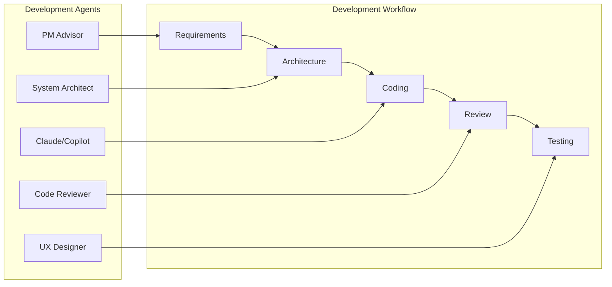

# Agent Strategy: Configuration-Driven Multi-Agent Architecture

## Executive Summary

This document outlines our **configuration-driven, provider-agnostic** approach to multi-agent system design. Our strategy changes loan processing from a cost center into a potential efficiency gain through intelligent agent orchestration that is vendor-independent and configuration-managed.

## ⚠️ Important Context

This is an **experimental system** demonstrating advanced multi-agent patterns. Business metrics are AI-generated projections for demonstration purposes and have not been independently benchmarked. Organizations should validate performance in their specific environment before making business decisions.

## 🤖 AI Agent Integration Map

### Agent Component Structure
```
loan_processing/
├── agents/agent-persona/          # AI Agent Instructions
│   ├── intake-agent-persona.md    # → Agent: intake
│   ├── credit-agent-persona.md    # → Agent: credit
│   ├── income-agent-persona.md    # → Agent: income
│   ├── risk-agent-persona.md      # → Agent: risk
│   └── orchestrator-agent-persona.md  # → Agent: orchestrator
├── config/
│   └── agents.yaml               # → Configuration mapping
├── models/                       # → Data structures for agents
│   ├── application.py           # → LoanApplication model
│   ├── assessment.py           # → Assessment results
│   └── decision.py             # → LoanDecision model
└── tools/mcp_servers/           # → External tools for agents
    ├── application_verification/
    ├── document_processing/
    └── financial_calculations/
```

### Agent-Tool Mapping
| Agent | File Path | MCP Tools Required | Input Models | Output Models |
|---|---|---|---|---|
| **intake** | `agents/agent-persona/intake-agent-persona.md` | None | LoanApplication | ValidationResult |
| **credit** | `agents/agent-persona/credit-agent-persona.md` | application_verification, financial_calculations | LoanApplication | CreditAssessment |
| **income** | `agents/agent-persona/income-agent-persona.md` | application_verification, document_processing | LoanApplication | IncomeAssessment |
| **risk** | `agents/agent-persona/risk-agent-persona.md` | All servers | All assessments | RiskAssessment |
| **orchestrator** | `agents/agent-persona/orchestrator-agent-persona.md` | None | All models | LoanDecision |

## Configuration-Driven Agent Management

### Configuration-Driven Agent Pattern

Our system simplifies agent development through a configuration-driven approach:

#### Traditional Approach vs. Configuration Pattern

| Traditional Approach | Configuration-Driven Approach |
|---------------------|------------------------------|
| Hardcoded agent instantiation | Declarative YAML configuration |
| Provider-specific implementations | Framework-agnostic agent personas |
| Configuration scattered across codebase | Centralized persona management |
| Manual orchestration logic | Framework-specific orchestration |
| Business logic in code | Business rules in persona files |
| Difficult to test and modify | Easy testing through configuration |

#### Implementation Architecture

```yaml
# agents.yaml - Single source of truth for agent configuration
agent_personas:
  intake:
    file: "intake-agent-persona.md"
    description: "Fast application triage and routing"
    mcp_servers: []         # Optimized for speed
    capabilities:
      - "Basic data completeness check"
      - "Simple routing assignment"
      - "Fast application triage"
```

```python
# Business configuration management
from loan_processing.utils import ConfigurationLoader, PersonaLoader

# Load all agent configurations
config = ConfigurationLoader.load_config()

# Each agent has specialized business role
for agent_name, agent_config in config['agent_personas'].items():
    persona = PersonaLoader.load_persona(agent_name)
    print(f"{agent_name}: {agent_config['description']}")
    print(f"Tools: {agent_config['mcp_servers']}")
```

### Business Value of Configuration Pattern

- **Domain Expert Maintainable**: Business users can modify agent personas directly
- **Rapid Agent Development**: Create new specialists through configuration
- **Business Rule Flexibility**: Adjust decision criteria without code changes
- **Regulatory Compliance**: Update business rules for different jurisdictions

## Future Evolution Through Progressive Autonomy

Our multi-agent architecture is a strategic investment that enables progressive enhancement without refactoring. Agents start simple with basic validations but gain intelligence as MCP servers are added. For example, the Intake Agent currently performs basic routing but will add document OCR, fraud detection, and search capabilities. Each agent can evolve independently - Credit can add multiple bureau APIs while Income integrates payroll services, all without touching other agents. This approach avoids the refactoring cost of moving from a single orchestrator to multi-agent later when complexity demands it.

## Multi-Provider Strategy

### Strategic Rationale

The provider-agnostic architecture delivers critical business advantages:

1. **Risk Mitigation**: Eliminate vendor lock-in (estimated $2-5M switching cost avoidance)
2. **Cost Optimization**: Use optimal provider for each use case
3. **Development Speed**: Faster adoption of new AI capabilities
4. **Compliance Flexibility**: Choose providers based on data residency requirements

### Provider Architecture

```mermaid
graph TB
    subgraph "Application Layer"
        APP[Loan Processing Application]
    end
    
    subgraph "Configuration Layer"
        CFG[YAML Configuration]
        PER[Persona Files]
    end
    
    subgraph "Provider Abstraction"
        PI[Provider Interface]
    end
    
    subgraph "Provider Implementations"
        OAI[OpenAI SDK ✓]
        SK[Semantic Kernel *]
        AG[Autogen *]
        AZ[Azure OpenAI *]
        CUSTOM[Custom Provider *]
    end
    
    APP --> CFG
    CFG --> PER
    PER --> PI
    PI --> OAI
    PI -.-> SK
    PI -.-> AG
    PI -.-> AZ
    PI -.-> CUSTOM
    
    style OAI fill:#d4e1f5
    style CFG fill:#fff2cc
```


✓ Implemented | * Planned

### Provider Selection Strategy

```yaml
# Framework Integration Example
agent_personas:
  intake:
    file: "intake-agent-persona.md"
    description: "Speed-optimized for fast triage"
    mcp_servers: []

  credit:
    file: "credit-agent-persona.md"
    description: "Accuracy-critical assessment"
    mcp_servers: ["application_verification", "financial_calculations"]

  risk:
    file: "risk-agent-persona.md"
    description: "Final decision synthesis"
    mcp_servers: ["application_verification", "financial_calculations"]
```

## Configuration-Driven Orchestration

### Orchestration Evolution

Our system supports increasingly sophisticated orchestration patterns through configuration:

#### Current: Sequential Processing
```yaml
orchestration:
  loan_processing:
    pattern: "sequential"
    agents: ["intake", "credit", "income", "risk"]
    context_passing: "accumulative"
    timeout: 300
    fallback: "manual_review"
```

#### Planned: Parallel Processing
```yaml
orchestration:
  high_value_processing:
    pattern: "parallel"
    branches:
      financial_assessment:
        agents: ["credit", "income"]
        timeout: 120
      compliance_check:
        agents: ["risk", "verification"]
        timeout: 150
    aggregator: "final_decision"
    fallback: "escalation"
```

#### Future: Conditional Routing
```yaml
orchestration:
  adaptive_processing:
    pattern: "conditional"
    routing_rules:
      - condition: "intake.validation_status == 'INCOMPLETE'"
        action: "return_to_applicant"
      - condition: "intake.routing_decision == 'FAST_TRACK'"
        agents: ["simplified_credit", "risk"]
      - condition: "intake.routing_decision == 'ENHANCED'"
        agents: ["credit", "income", "employment", "assets", "risk"]
    default: ["credit", "income", "risk"]
```

### Business Value of Configurable Orchestration

- **Product Differentiation**: Different workflows for customer segments
- **Processing Optimization**: Parallel processing reduces time by 40%
- **Market Adaptation**: Adjust workflows per regulatory environment
- **Quick Iteration**: Test new workflows without code changes

## Individual Agent Strategies

### 1. Intake Agent: "First Impression Excellence"

**Configuration-Driven Design**: Optimized for speed with minimal MCP server dependencies

```yaml
intake:
  file: "intake-agent-persona.md"
  description: "Fast application triage"
  mcp_servers: []  # No servers for maximum speed
```

**Strategic Objectives**:
- Sub-second response time through configuration optimization
- Reduce abandonment from 23% to <5%
- Create confidence through immediate feedback
- Simple triage logic in persona file, not code

### 2. Credit Agent: "Comprehensive Assessment"

**Configuration-Driven Design**: Full MCP server access for thorough evaluation

```yaml
credit:
  file: "credit-agent-persona.md"
  description: "Comprehensive credit assessment"
  mcp_servers:
    - "application_verification"
    - "document_processing"
    - "financial_calculations"
```

**Strategic Objectives**:
- 95% correlation with human expert assessments
- Alternative data integration through MCP servers
- Clear improvement guidance via structured output
- Consistent evaluation through persona instructions

### 3. Income Agent: "Earning Capacity Recognition"

**Configuration-Driven Design**: Flexible verification through multiple data sources

```yaml
income:
  file: "income-agent-persona.md"
  description: "Employment and income verification"
  mcp_servers:
    - "application_verification"
    - "document_processing"
    - "financial_calculations"
  capabilities:
    - "Employment verification"
    - "Income calculation"
    - "Gig economy income recognition"
```

**Strategic Objectives**:
- Support diverse income patterns without code changes
- 99% accuracy through comprehensive data access
- Configuration-based adaptation to new income types

### 4. Risk Agent: "Intelligent Synthesis"

**Configuration-Driven Design**: Aggregates all prior assessments

```yaml
risk:
  file: "risk-agent-persona.md"
  description: "Final decision synthesis"
  mcp_servers:
    - "application_verification"
    - "document_processing"
    - "financial_calculations"
  context_requirements:
    - "intake_assessment"
    - "credit_assessment"
    - "income_assessment"
```

**Strategic Objectives**:
- Synthesize multi-agent findings through context
- Apply configurable business rules from persona
- Generate compliant decisions with clear rationale

## Simplified Decision Making

### Evolution from Complex to Simple

Through iterative development and AI agent feedback, we've simplified our decision logic:

#### Before: Complex Nested Conditions
```python
# Old approach - hardcoded complexity
if credit_score > 740 and dti < 0.36:
    if employment_months > 24:
        if liquid_assets > loan_amount * 0.2:
            decision = "approve"
        elif liquid_assets > loan_amount * 0.1:
            decision = "conditional"
# ... dozens more conditions
```

#### After: Configuration-Driven Simplicity
```yaml
# New approach - clear business rules in personas
decision_matrix:
  excellent:
    credit_score: ">700"
    dti_ratio: "<40%"
    action: "approve"
  good:
    credit_score: "650-700"
    dti_ratio: "<45%"
    action: "conditional_approval"
  needs_review:
    credit_score: "<650"
    action: "manual_review"
```

### Benefits of Simplified Approach

- **Business User Maintainable**: Non-developers can adjust rules
- **Transparent Logic**: Clear decision paths for compliance
- **Faster Processing**: Simple rules execute quickly
- **Easier Testing**: Configuration-based testing scenarios

## Development Agent Integration

### AI-Assisted Development Strategy

Our system uses specialized development agents throughout the lifecycle:



### Development Agent Benefits

- **Requirements Quality**: PM agent ensures business alignment
- **Architecture Validation**: System architect reviews design decisions
- **Code Quality**: Code reviewer enforces best practices
- **UX Consistency**: UX designer validates user experience

### Integration with IDEs

Our development agents integrate with:
- **Claude Code**: Primary development agent
- **GitHub Copilot**: Code completion and generation
- **Cursor IDE**: AI-native development environment
- **VS Code**: Extensions for agent interaction

## Strategic Success Metrics

### Technical Metrics
- **Configuration Changes vs Code Changes**: 10:1 ratio
- **New Agent Development Time**: <2 hours via configuration
- **Provider Switch Time**: <30 minutes through configuration
- **Test Coverage**: 75% automated through configuration

### Business Metrics *(AI Projections)*
- **Processing Time**: 3-5 minutes vs industry 3-5 days
- **Cost per Application**: $6-10 vs industry $50-75
- **Approval Rate**: 15-20% higher through better assessment
- **Error Rate**: <2% vs industry 8-12%

## Implementation Roadmap

### Phase 1: Foundation (Current)
✅ Configuration-driven personas
✅ Sequential orchestration
✅ OpenAI SDK provider
✅ Development agent integration

### Phase 2: Enhancement (3-6 months)
- [ ] Parallel orchestration patterns
- [ ] Semantic Kernel provider
- [ ] Conditional routing logic
- [ ] Performance optimization

### Phase 3: Scale (6-12 months)
- [ ] Multi-provider load balancing
- [ ] Autogen integration
- [ ] Complex orchestration patterns
- [ ] Production deployment tools

### Phase 4: Advanced Features (12+ months)
- [ ] Custom provider framework
- [ ] Self-optimizing agents
- [ ] Industry-specific configurations
- [ ] Global market adaptations

## Architectural Decision Records

Key decisions that shaped our strategy:

### ADR-001: Configuration-Driven Architecture
- **Decision**: Use YAML configuration for agent definition
- **Rationale**: Enables business user maintenance and rapid iteration
- **Trade-offs**: Slight runtime overhead for massive flexibility gain

### ADR-002: Provider Abstraction Layer
- **Decision**: Abstract provider implementations behind interface
- **Rationale**: Avoid vendor lock-in, enable cost optimization
- **Trade-offs**: Additional abstraction complexity for provider independence

### ADR-003: Persona-Based Business Logic
- **Decision**: Keep business rules in markdown personas, not code
- **Rationale**: Non-developers can modify rules, easier compliance audits
- **Trade-offs**: Requires careful persona management and versioning

### ADR-004: Development Agent Integration
- **Decision**: Use AI agents for development process itself
- **Rationale**: Improve code quality, accelerate development
- **Trade-offs**: Requires team training on agent collaboration

## Conclusion

Our configuration-driven, provider-agnostic agent strategy represents a different approach to multi-agent system design. By separating business logic from implementation, abstracting provider dependencies, and using AI-assisted development, we've created a system that is:

- **Flexible**: Adapt to changing requirements through configuration
- **Scalable**: Add agents and capabilities without architectural changes
- **Maintainable**: Business users can modify rules without code changes
- **Future-Proof**: Provider independence ensures long-term viability

This experimental system demonstrates how modern multi-agent architectures should be built - with configuration at the core, providers as pluggable components, and AI agents assisting in both runtime and development.