# Correct Two-Endpoint API Architecture Design

**Status**: Recommended Architecture
**Date**: 2025-09-29
**Related ADRs**: ADR-004, ADR-005, ADR-006, ADR-007, ADR-010

---

## Executive Summary

This document provides the **correct architectural design** for implementing the Loan Defenders API using the two-endpoint pattern that properly separates conversational data collection from formal loan processing.

### Key Principles

1. **Separation of Concerns**: Cap-ital America collects data (conversational), WorkflowOrchestrator processes applications (technical)
2. **Type Safety**: Strict type progression from `str` → `Dict[str, Any]` → `LoanApplication` → `LoanDecision`
3. **ADR Compliance**: Follows ADR-004 dual-layer architecture, ADR-006 sequential orchestration
4. **Framework Alignment**: Proper use of Microsoft Agent Framework patterns

### Architecture Score: **9.5/10** (vs. unified_workflow.py: 4.5/10)

---

## Table of Contents

1. [System Architecture Overview](#system-architecture-overview)
2. [Sequence Diagrams](#sequence-diagrams)
3. [Component Architecture](#component-architecture)
4. [API Endpoint Specifications](#api-endpoint-specifications)
5. [State Management Design](#state-management-design)
6. [Integration Points](#integration-points)
7. [Implementation Checklist](#implementation-checklist)
8. [Migration Strategy](#migration-strategy)
9. [Testing Strategy](#testing-strategy)
10. [Answers to Specific Questions](#answers-to-specific-questions)

---

## System Architecture Overview

### High-Level Architecture

```
┌─────────────────────────────────────────────────────────────────┐
│                        Frontend (React)                          │
│  ┌──────────────────┐              ┌──────────────────────┐    │
│  │  Cap-ital America Chat UI   │              │  Progress Display    │    │
│  │  (Collection)    │              │  (Processing)        │    │
│  └────────┬─────────┘              └──────────┬───────────┘    │
└───────────┼────────────────────────────────────┼────────────────┘
            │                                     │
            │ POST /api/chat                     │ POST /api/process
            │ (Iterative)                        │ (One-shot, streaming)
            │                                     │
┌───────────┼─────────────────────────────────────┼────────────────┐
│           │          FastAPI Backend            │                │
│  ┌────────▼────────┐                   ┌────────▼──────────┐    │
│  │  /api/chat      │                   │  /api/process     │    │
│  │  Endpoint       │                   │  Endpoint         │    │
│  └────────┬────────┘                   └────────┬──────────┘    │
│           │                                      │                │
│  ┌────────▼────────┐                   ┌────────▼──────────┐    │
│  │ RileyCoordinator│                   │WorkflowOrchestrator│   │
│  │ (Conversational)│                   │ (Technical)        │    │
│  └────────┬────────┘                   └────────┬──────────┘    │
│           │                                      │                │
│           │    LoanApplication                   │                │
│           │    create_loan_application()         │                │
│           └──────────────────────────────────────┘                │
│                                                                    │
│  ┌──────────────────────────────────────────────────────────┐   │
│  │               ConversationSession                         │   │
│  │  - collected_data: Dict[str, Any]                        │   │
│  │  - application: LoanApplication | None                    │   │
│  │  - decision: LoanDecision | None                          │   │
│  │  - agent_thread: AgentThread                              │   │
│  │  - status: active|ready|processing|completed              │   │
│  └──────────────────────────────────────────────────────────┘   │
└─────────────────────────────────────────────────────────────────┘
```

### Phase Separation

**Phase 1: Conversational Collection** (Cap-ital America)
- **Endpoint**: `POST /api/chat`
- **Pattern**: Iterative conversation (multiple requests)
- **Input**: User message (string)
- **Output**: Cap-ital America response with collected data
- **State**: Accumulated in `session.collected_data`
- **Completion**: When Cap-ital America determines data is complete (`action: "ready_for_processing"`)

**Phase 2: Formal Processing** (WorkflowOrchestrator)
- **Endpoint**: `POST /api/process`
- **Pattern**: One-shot processing (single request, streams events)
- **Input**: Session ID (references complete application data)
- **Output**: Streaming workflow events → Final LoanDecision
- **State**: Read from `session.application`, write to `session.decision`
- **Completion**: When final decision is made

---

## Sequence Diagrams

### Complete User Journey: Collection to Decision

```mermaid
sequenceDiagram
    participant User
    participant Frontend
    participant ChatAPI as /api/chat
    participant Cap-ital America as RileyCoordinator
    participant Session as ConversationSession
    participant ProcessAPI as /api/process
    participant Workflow as WorkflowOrchestrator
    participant Agents as Technical Agents

    %% Phase 1: Data Collection
    Note over User,Session: Phase 1: Conversational Data Collection

    User->>Frontend: Opens loan application
    Frontend->>ChatAPI: POST /api/chat (initial greeting)
    ChatAPI->>Session: create_session()
    Session-->>ChatAPI: session_id
    ChatAPI->>Cap-ital America: process_conversation("", thread, {})
    Cap-ital America-->>ChatAPI: RileyResponse (greeting, 0% complete)
    ChatAPI-->>Frontend: ConversationResponse
    Frontend-->>User: Cap-ital America greeting displayed

    loop Until data complete
        User->>Frontend: Types message (e.g., "I need a home loan")
        Frontend->>ChatAPI: POST /api/chat {user_message, session_id}
        ChatAPI->>Session: get_session(session_id)
        Session-->>ChatAPI: session with collected_data
        ChatAPI->>Cap-ital America: process_conversation(msg, thread, collected_data)
        Cap-ital America-->>ChatAPI: RileyResponse (updated data, completion %)
        ChatAPI->>Session: update_data(collected_data, completion)
        ChatAPI-->>Frontend: ConversationResponse
        Frontend-->>User: Cap-ital America response + progress bar
    end

    %% Transition point
    Note over User,Session: Transition: Data Collection Complete

    User->>Frontend: Final message (completes data)
    Frontend->>ChatAPI: POST /api/chat {user_message, session_id}
    ChatAPI->>Cap-ital America: process_conversation(msg, thread, collected_data)
    Cap-ital America-->>ChatAPI: RileyResponse (action: "ready_for_processing", 100%)
    ChatAPI->>Session: mark_ready_for_processing()
    ChatAPI-->>Frontend: ConversationResponse (action: "ready_for_processing")
    Frontend-->>User: "Ready to process!" + transition UI

    %% Phase 2: Formal Processing
    Note over User,Agents: Phase 2: Formal Loan Processing

    User->>Frontend: Clicks "Submit Application"
    Frontend->>ProcessAPI: POST /api/process {session_id}
    ProcessAPI->>Session: get_session(session_id)
    Session-->>ProcessAPI: session with collected_data
    ProcessAPI->>Cap-ital America: create_loan_application(collected_data)
    Cap-ital America-->>ProcessAPI: LoanApplication (validated)
    ProcessAPI->>Session: start_processing(application)
    ProcessAPI->>Workflow: process_loan_application(application, thread)

    loop Workflow streaming
        Workflow->>Agents: Intake → Credit → Income → Risk
        Agents-->>Workflow: Assessment results
        Workflow-->>ProcessAPI: WorkflowResponse events (streaming)
        ProcessAPI-->>Frontend: SSE events
        Frontend-->>User: Progress updates by agent
    end

    Workflow-->>ProcessAPI: Final WorkflowResponse with LoanDecision
    ProcessAPI->>Session: complete_processing(decision)
    ProcessAPI-->>Frontend: Final decision event
    Frontend-->>User: Decision displayed with celebration/guidance
```



### Phase 1: Conversational Collection Detail


### Phase 2: Formal Processing Detail


### State Transition Diagram


---

## Component Architecture

### Component Diagram

```mermaid
graph TB
    subgraph "Frontend Layer"
        ChatUI[Cap-ital America Chat Component]
        ProgressUI[Progress Display Component]
        DecisionUI[Decision Display Component]
    end

    subgraph "API Layer"
        ChatEndpoint[/api/chat Endpoint]
        ProcessEndpoint[/api/process Endpoint]
        SessionEndpoint[/api/sessions/* Endpoints]
    end

    subgraph "Agent Layer"
        Cap-ital America[RileyCoordinator<br/>Conversational Collection]
        Workflow[WorkflowOrchestrator<br/>Technical Processing]

        subgraph "Technical Agents"
            Intake[Intake Agent<br/>Intake Agent]
            Credit[Credit Agent<br/>Scarlet Witch-Credit]
            Income[Income Agent<br/>Hawk-Income]
            Risk[Risk Agent<br/>Doctor Strange-Risk]
        end
    end

    subgraph "State Layer"
        SessionMgr[SessionManager]
        ConvSession[ConversationSession<br/>- collected_data<br/>- application<br/>- decision<br/>- agent_thread<br/>- status]
    end

    subgraph "Framework Layer"
        AgentThread[AgentThread<br/>Conversation Context]
        SequentialBuilder[SequentialBuilder<br/>Workflow Construction]
    end

    subgraph "Model Layer"
        Models[LoanApplication<br/>LoanDecision<br/>Pydantic Validation]
    end

    ChatUI -->|POST /api/chat| ChatEndpoint
    ChatEndpoint --> Cap-ital America
    ChatEndpoint --> SessionMgr
    SessionMgr --> ConvSession
    Cap-ital America --> AgentThread
    Cap-ital America --> Models

    ProgressUI -->|POST /api/process| ProcessEndpoint
    ProcessEndpoint --> SessionMgr
    ProcessEndpoint --> Cap-ital America
    ProcessEndpoint --> Workflow
    Workflow --> SequentialBuilder
    Workflow --> AgentThread
    SequentialBuilder --> Intake
    SequentialBuilder --> Credit
    SequentialBuilder --> Income
    SequentialBuilder --> Risk

    Workflow --> Models
    ProcessEndpoint -->|SSE| DecisionUI

    style Cap-ital America fill:#e1f5e1
    style Workflow fill:#fff4e1
    style Intake fill:#fff4e1
    style Credit fill:#fff4e1
    style Income fill:#fff4e1
    style Risk fill:#fff4e1
    style ConvSession fill:#e1f0ff
```

### Separation of Concerns

#### Layer 1: Conversational Collection (Cap-ital America)
- **Purpose**: Natural language data gathering
- **Responsibility**: Extract application data from conversation
- **Input**: User messages (strings)
- **Output**: Collected data (Dict[str, Any])
- **Pattern**: Iterative (multiple turns)
- **Temperature**: 0.7 (conversational)
- **No MCP Tools**: Cap-ital America doesn't process, just collects

#### Layer 2: Technical Processing (WorkflowOrchestrator)
- **Purpose**: Formal loan application processing
- **Responsibility**: Execute business logic, generate decision
- **Input**: LoanApplication (validated Pydantic)
- **Output**: LoanDecision (validated Pydantic)
- **Pattern**: One-shot (single workflow run)
- **Temperature**: 0.1-0.2 (analytical)
- **MCP Tools**: Credit bureau, document processing, financial calculations

#### Transition Point: Data Validation
```python
# Cap-ital America's responsibility
collected_data: Dict[str, Any] = riley.process_conversation(...)

# Transition: Validation
application: LoanApplication = riley.create_loan_application(collected_data)
# ^^ This raises ValueError if data is invalid/incomplete

# WorkflowOrchestrator's responsibility
decision: LoanDecision = workflow.process_loan_application(application)
```

---

## API Endpoint Specifications

### Endpoint 1: POST /api/chat

**Purpose**: Handle conversational data collection with Cap-ital America

**Request Schema**:
```python
class ConversationRequest(BaseModel):
    user_message: str = Field(
        ...,
        description="User's message in the conversation",
        min_length=1,
        max_length=2000,
        examples=["I need a home loan for $300,000"]
    )
    session_id: str | None = Field(
        None,
        description="Session ID for conversation continuity (optional for first message)"
    )
```

**Response Schema**:
```python
class ConversationResponse(BaseModel):
    agent_name: str = Field(
        default="Cap-ital America",
        description="Name of the responding agent"
    )
    message: str = Field(
        ...,
        description="Cap-ital America's conversational response to the user"
    )
    action: str = Field(
        ...,
        description="Current action status",
        pattern="^(collect_info|ready_for_processing|need_clarification|error)$"
    )
    collected_data: Dict[str, Any] = Field(
        default_factory=dict,
        description="Application data collected so far (can be partial)"
    )
    next_step: str = Field(
        ...,
        description="Brief description of what Cap-ital America will ask/do next"
    )
    completion_percentage: int = Field(
        ...,
        ge=0,
        le=100,
        description="Percentage of required data collected (0-100)"
    )
    session_id: str = Field(
        ...,
        description="Session ID for subsequent requests"
    )
```

**Response Examples**:

*Initial greeting (no user message yet):*
```json
{
  "agent_name": "Cap-ital America",
  "message": "Hi! I'm Cap-ital America, your friendly loan coordinator! 😊 I'm here to help you with your loan application. What type of loan are you interested in?",
  "action": "collect_info",
  "collected_data": {},
  "next_step": "Waiting for loan type",
  "completion_percentage": 0,
  "session_id": "550e8400-e29b-41d4-a716-446655440000"
}
```

*Mid-conversation (data being collected):*
```json
{
  "agent_name": "Cap-ital America",
  "message": "Wonderful! A $300,000 home loan - that's a great investment! 🏡 Now, could you tell me your full name?",
  "action": "collect_info",
  "collected_data": {
    "loan_amount": 300000,
    "loan_purpose": "home",
    "loan_term_months": 360
  },
  "next_step": "Collecting applicant name",
  "completion_percentage": 25,
  "session_id": "550e8400-e29b-41d4-a716-446655440000"
}
```

*Data collection complete:*
```json
{
  "agent_name": "Cap-ital America",
  "message": "Perfect! I have everything I need. ✨ Your application is ready to be processed by our specialist team. Would you like me to submit it now?",
  "action": "ready_for_processing",
  "collected_data": {
    "applicant_name": "Intake Agent Doe",
    "email": "john@example.com",
    "phone": "+1-555-123-4567",
    "date_of_birth": "1985-06-15",
    "loan_amount": 300000,
    "loan_purpose": "home",
    "loan_term_months": 360,
    "annual_income": 120000,
    "employment_status": "employed",
    "employer_name": "Tech Corp",
    "months_employed": 48
  },
  "next_step": "Ready for formal processing",
  "completion_percentage": 100,
  "session_id": "550e8400-e29b-41d4-a716-446655440000"
}
```

**Error Responses**:

*500 Internal Server Error:*
```json
{
  "error": "Failed to process conversation",
  "details": "Agent framework connection failed",
  "error_code": "AGENT_UNAVAILABLE"
}
```

**Implementation**:
```python
@app.post("/api/chat", response_model=ConversationResponse)
async def handle_chat(request: ConversationRequest):
    """
    Handle conversational data collection with Cap-ital America.

    This endpoint manages ONLY the collection phase:
    - Natural language conversation
    - Data extraction and accumulation
    - Progress tracking
    - Readiness determination

    Does NOT perform formal loan processing.
    Use POST /api/process when action = "ready_for_processing".
    """
    # Get or create session
    session = session_manager.get_or_create_session(request.session_id)

    # Initialize Cap-ital America
    riley = RileyCoordinator()

    # Process conversation
    response = await riley.process_conversation(
        user_message=request.user_message,
        thread=session.get_or_create_thread(),
        current_data=session.collected_data
    )

    # Update session state
    session.update_data(
        response.assessment.collected_data,
        response.assessment.completion_percentage
    )

    # Mark ready if Cap-ital America says so
    if response.assessment.action == "ready_for_processing":
        session.mark_ready_for_processing()

    # Return response
    return ConversationResponse(
        agent_name="Cap-ital America",
        message=response.assessment.message,
        action=response.assessment.action,
        collected_data=response.assessment.collected_data,
        completion_percentage=response.assessment.completion_percentage,
        next_step=response.assessment.next_step,
        session_id=session.session_id
    )
```

---

### Endpoint 2: POST /api/process

**Purpose**: Process complete loan application through WorkflowOrchestrator

**Request Schema**:
```python
class ProcessingRequest(BaseModel):
    session_id: str = Field(
        ...,
        description="Session ID containing complete application data"
    )
```

**Response**: Server-Sent Events (SSE) stream

**Event Format**:
```python
class WorkflowEvent(BaseModel):
    agent_name: str = Field(
        ...,
        description="Name of the agent currently processing"
    )
    content: str = Field(
        ...,
        description="Event content/message"
    )
    metadata: Dict[str, Any] | None = Field(
        None,
        description="Additional event metadata (step, status, etc.)"
    )
    event_type: str = Field(
        default="agent_update",
        description="Type of event",
        pattern="^(agent_update|phase_transition|final_decision|error)$"
    )
```

**SSE Stream Example**:

```
event: agent_update
data: {"agent_name": "Intake_Agent", "content": "Validating application completeness...", "event_type": "agent_update", "metadata": {"step": "intake_validation", "phase": "validating"}}

event: agent_update
data: {"agent_name": "Intake_Agent", "content": "Application data verified. All required fields present.", "event_type": "agent_update", "metadata": {"step": "intake_validation", "phase": "validating"}}

event: phase_transition
data: {"agent_name": "Workflow_Orchestrator", "content": "Moving to credit assessment...", "event_type": "phase_transition", "metadata": {"from_phase": "validating", "to_phase": "credit_assessment"}}

event: agent_update
data: {"agent_name": "Credit_Agent", "content": "Analyzing credit history and debt-to-income ratio...", "event_type": "agent_update", "metadata": {"step": "credit_assessment", "phase": "credit"}}

event: agent_update
data: {"agent_name": "Credit_Agent", "content": "Credit score: 750. DTI ratio: 28%. Strong creditworthiness.", "event_type": "agent_update", "metadata": {"step": "credit_assessment", "phase": "credit"}}

event: phase_transition
data: {"agent_name": "Workflow_Orchestrator", "content": "Moving to income verification...", "event_type": "phase_transition", "metadata": {"from_phase": "credit", "to_phase": "income_verification"}}

event: agent_update
data: {"agent_name": "Income_Agent", "content": "Verifying employment and income stability...", "event_type": "agent_update", "metadata": {"step": "income_verification", "phase": "income"}}

event: agent_update
data: {"agent_name": "Income_Agent", "content": "Verified: $120k annual income, 4 years employment. Income stable.", "event_type": "agent_update", "metadata": {"step": "income_verification", "phase": "income"}}

event: phase_transition
data: {"agent_name": "Workflow_Orchestrator", "content": "Moving to risk analysis...", "event_type": "phase_transition", "metadata": {"from_phase": "income", "to_phase": "risk_analysis"}}

event: agent_update
data: {"agent_name": "Risk_Agent", "content": "Synthesizing all assessments for final risk determination...", "event_type": "agent_update", "metadata": {"step": "risk_analysis", "phase": "risk"}}

event: final_decision
data: {
  "agent_name": "Workflow_Orchestrator",
  "content": "🎉 Loan Application APPROVED!",
  "event_type": "final_decision",
  "metadata": {
    "step": "final_decision",
    "decision": {
      "application_id": "LN987654321",
      "decision": "approved",
      "decision_reason": "Strong credit profile, stable income, acceptable risk",
      "confidence_score": 0.92,
      "approved_amount": 300000,
      "approved_rate": 0.0625,
      "approved_term_months": 360,
      "conditions": ["Final employment verification", "Property appraisal required"],
      "decision_maker": "WorkflowOrchestrator",
      "reasoning": "Applicant demonstrates excellent creditworthiness (750 score), stable employment (4 years), and strong income ($120k) relative to loan amount ($300k). Debt-to-income ratio of 28% is well within acceptable limits. Risk analysis indicates low default probability.",
      "agents_consulted": ["Intake_Agent", "Credit_Agent", "Income_Agent", "Risk_Agent"],
      "processing_duration_seconds": 12.3,
      "review_priority": "standard",
      "orchestration_pattern": "sequential"
    }
  }
}
```

**Error Event Example**:
```
event: error
data: {"agent_name": "Workflow_Orchestrator", "content": "Application processing failed: Credit bureau service unavailable", "event_type": "error", "metadata": {"error_code": "CREDIT_BUREAU_UNAVAILABLE", "retry_possible": true}}
```

**Implementation**:
```python
from fastapi.responses import StreamingResponse
import json

@app.post("/api/process")
async def handle_processing(request: ProcessingRequest):
    """
    Process formal loan application through WorkflowOrchestrator.

    This endpoint manages ONLY the processing phase:
    - Validates session is ready
    - Creates validated LoanApplication from collected data
    - Runs sequential agent workflow (Intake → Credit → Income → Risk)
    - Streams workflow events in real-time
    - Generates final loan decision

    Requires: session_id with status "ready_for_processing".
    Returns: Server-Sent Events (SSE) stream.
    """

    async def event_generator():
        try:
            # Get session
            session = session_manager.get_session(request.session_id)
            if not session:
                error_event = {
                    "agent_name": "System",
                    "content": "Session not found",
                    "event_type": "error",
                    "metadata": {"error_code": "SESSION_NOT_FOUND"}
                }
                yield f"event: error\ndata: {json.dumps(error_event)}\n\n"
                return

            if session.status != "ready_for_processing":
                error_event = {
                    "agent_name": "System",
                    "content": f"Session not ready for processing. Current status: {session.status}",
                    "event_type": "error",
                    "metadata": {"error_code": "SESSION_NOT_READY", "status": session.status}
                }
                yield f"event: error\ndata: {json.dumps(error_event)}\n\n"
                return

            # Create validated LoanApplication
            riley = RileyCoordinator()
            try:
                application = riley.create_loan_application(session.collected_data)
            except ValueError as e:
                error_event = {
                    "agent_name": "System",
                    "content": f"Invalid application data: {str(e)}",
                    "event_type": "error",
                    "metadata": {"error_code": "VALIDATION_FAILED", "details": str(e)}
                }
                yield f"event: error\ndata: {json.dumps(error_event)}\n\n"
                return

            # Mark session as processing
            session.start_processing(application)

            # Initialize WorkflowOrchestrator
            orchestrator = WorkflowOrchestrator()

            # Stream workflow events
            async for workflow_response in orchestrator.process_loan_application(
                application,
                thread=session.get_or_create_thread()
            ):
                # Convert WorkflowResponse to SSE event
                event_data = {
                    "agent_name": workflow_response.agent_name,
                    "content": workflow_response.content,
                    "event_type": workflow_response.metadata.get("event_type", "agent_update"),
                    "metadata": workflow_response.metadata
                }

                event_type = event_data["event_type"]
                yield f"event: {event_type}\ndata: {json.dumps(event_data)}\n\n"

                # If final decision, complete session
                if event_type == "final_decision" and "decision" in workflow_response.metadata:
                    decision_dict = workflow_response.metadata["decision"]
                    decision = LoanDecision(**decision_dict)
                    session.complete_processing(decision)

        except Exception as e:
            logger.error(f"Processing stream error: {e}", exc_info=True)
            error_event = {
                "agent_name": "System",
                "content": f"Processing error: {str(e)}",
                "event_type": "error",
                "metadata": {"error_code": "PROCESSING_ERROR", "details": str(e)}
            }
            yield f"event: error\ndata: {json.dumps(error_event)}\n\n"

    return StreamingResponse(
        event_generator(),
        media_type="text/event-stream",
        headers={
            "Cache-Control": "no-cache",
            "Connection": "keep-alive",
            "X-Accel-Buffering": "no"  # Disable nginx buffering
        }
    )
```

---

## State Management Design

### Single Source of Truth: ConversationSession

```python
class ConversationSession:
    """
    Single source of truth for session state.

    Manages both collection and processing phases with clear state transitions.
    """

    def __init__(self, session_id: str | None = None):
        self.session_id = session_id or str(uuid.uuid4())
        self.created_at = datetime.now(timezone.utc)
        self.last_activity = datetime.now(timezone.utc)

        # Collection phase state
        self.collected_data: Dict[str, Any] = {}
        self.completion_percentage: int = 0
        self.collection_status: Literal["active", "complete"] = "active"

        # Processing phase state
        self.processing_status: Literal["pending", "ready", "processing", "completed", "error"] = "pending"
        self.application: LoanApplication | None = None
        self.decision: LoanDecision | None = None

        # Framework integration (private)
        self._agent_thread: AgentThread | None = None

    # Overall session status (for API responses)
    @property
    def status(self) -> str:
        """
        Compute overall session status from phase-specific states.

        Returns one of:
        - "active": Collection in progress
        - "ready_for_processing": Collection complete, ready to process
        - "processing": WorkflowOrchestrator running
        - "completed": Final decision made
        - "error": Error occurred
        """
        if self.processing_status == "error":
            return "error"
        if self.processing_status == "completed":
            return "completed"
        if self.processing_status == "processing":
            return "processing"
        if self.processing_status == "ready":
            return "ready_for_processing"
        if self.collection_status == "active":
            return "active"
        return "active"

    def get_or_create_thread(self) -> AgentThread:
        """
        Get AgentThread for Microsoft Agent Framework integration.

        The thread provides conversation context for both Cap-ital America and
        WorkflowOrchestrator, enabling conversation continuity.
        """
        if not self._agent_thread:
            self._agent_thread = AgentThread()
            logger.debug(f"Created AgentThread for session {self.session_id[:8]}***")
        return self._agent_thread

    # Collection phase methods

    def update_data(self, new_data: Dict[str, Any], completion_percentage: int) -> None:
        """
        Update collected application data during collection phase.

        Called after each Cap-ital America conversation turn.
        """
        self.collected_data.update(new_data)
        self.completion_percentage = completion_percentage
        self.last_activity = datetime.now(timezone.utc)

        if completion_percentage >= 100:
            self.collection_status = "complete"

    def mark_ready_for_processing(self) -> None:
        """
        Mark session as ready for formal processing.

        Called when Cap-ital America determines data collection is complete.
        """
        self.collection_status = "complete"
        self.processing_status = "ready"
        self.last_activity = datetime.now(timezone.utc)

    # Processing phase methods

    def start_processing(self, application: LoanApplication) -> None:
        """
        Transition to processing phase.

        Called when /api/process endpoint begins workflow.
        """
        self.application = application
        self.processing_status = "processing"
        self.last_activity = datetime.now(timezone.utc)

    def complete_processing(self, decision: LoanDecision) -> None:
        """
        Complete processing phase with final decision.

        Called when WorkflowOrchestrator produces final decision.
        """
        self.decision = decision
        self.processing_status = "completed"
        self.last_activity = datetime.now(timezone.utc)

    def mark_error(self, error_details: str | None = None) -> None:
        """Mark session as errored."""
        self.processing_status = "error"
        self.last_activity = datetime.now(timezone.utc)
        logger.error(f"Session {self.session_id[:8]}*** marked as error: {error_details}")

    # Serialization

    def to_dict(self) -> Dict[str, Any]:
        """Convert session to dictionary for API responses."""
        return {
            "session_id": self.session_id,
            "created_at": self.created_at.isoformat(),
            "last_activity": self.last_activity.isoformat(),
            "status": self.status,  # Computed property
            "collection_status": self.collection_status,
            "processing_status": self.processing_status,
            "completion_percentage": self.completion_percentage,
            "collected_data": self.collected_data,
            "has_application": self.application is not None,
            "has_decision": self.decision is not None,
        }
```

### State Transition Rules

```
┌─────────────────────────────────────────────────────────────┐
│                    Session Lifecycle                        │
└─────────────────────────────────────────────────────────────┘

Status: "active" (Initial)
├─ collection_status: "active"
├─ processing_status: "pending"
├─ collected_data: {} (empty or partial)
├─ completion_percentage: 0-99
└─ Allowed operations: POST /api/chat

        ↓ Cap-ital America conversation turns (multiple)

Status: "active" (Data accumulating)
├─ collection_status: "active"
├─ processing_status: "pending"
├─ collected_data: {...} (partial, growing)
├─ completion_percentage: 0-99 (increasing)
└─ Allowed operations: POST /api/chat

        ↓ Cap-ital America determines complete (action: "ready_for_processing")

Status: "ready_for_processing" (Transition point)
├─ collection_status: "complete"
├─ processing_status: "ready"
├─ collected_data: {...} (complete)
├─ completion_percentage: 100
└─ Allowed operations: POST /api/process

        ↓ /api/process called, LoanApplication created

Status: "processing" (WorkflowOrchestrator running)
├─ collection_status: "complete"
├─ processing_status: "processing"
├─ application: LoanApplication (validated)
├─ collected_data: {...} (frozen)
└─ Allowed operations: (none - processing in progress)

        ↓ Workflow completes with decision

Status: "completed" (Final)
├─ collection_status: "complete"
├─ processing_status: "completed"
├─ application: LoanApplication
├─ decision: LoanDecision
└─ Allowed operations: GET /api/sessions/{id}

        ↓ (Alternative path from any state)

Status: "error" (Error occurred)
├─ processing_status: "error"
├─ Error details logged
└─ Allowed operations: GET /api/sessions/{id}
```

### No SharedState Duplication

**Important**: Do NOT use Microsoft Agent Framework's `SharedState` for application data storage.

**Why**:
- Creates duplication with `ConversationSession.collected_data`
- Synchronization challenges
- Unclear source of truth
- Additional complexity

**Correct pattern**:
```python
# ✅ CORRECT: Session is source of truth
session = session_manager.get_session(session_id)
application_data = session.collected_data  # Read from session

# Pass data as context to agents, not via SharedState
riley_response = await riley.process_conversation(
    user_message=msg,
    thread=session.get_or_create_thread(),
    current_data=session.collected_data  # Explicit parameter
)

# ❌ WRONG: Duplicating in SharedState
shared_state = SharedState()
await shared_state.set("application_data", session.collected_data)  # NO!
```

**SharedState use cases** (if needed in future):
- Agent-to-agent temporary communication within a single workflow run
- Caching computed values during processing
- **NOT for persisting application data**

---

## Integration Points

### Integration Point 1: Cap-ital America → LoanApplication Validation

**Location**: Transition from collection to processing

**Code**:
```python
# In /api/process endpoint
session = session_manager.get_session(request.session_id)

# Integration point: Convert collected data to validated model
riley = RileyCoordinator()
try:
    application = riley.create_loan_application(session.collected_data)
except ValueError as e:
    # Validation failed - data incomplete or invalid
    raise HTTPException(400, f"Invalid application data: {str(e)}")

# If successful, application is now a validated Pydantic model
# Safe to pass to WorkflowOrchestrator
```

**RileyCoordinator.create_loan_application()** (already implemented):
```python
def create_loan_application(self, collected_data: Dict[str, Any]) -> LoanApplication:
    """
    Convert collected data into validated LoanApplication.

    Raises:
        ValueError: If required fields missing or validation fails
    """
    application_data = {
        "application_id": f"LN{hash(collected_data.get('email', 'unknown'))}"[-10:],
        "applicant_name": collected_data.get("applicant_name"),
        "applicant_id": str(hash(collected_data.get("email", "unknown"))),
        "email": collected_data.get("email"),
        "phone": collected_data.get("phone"),
        "date_of_birth": collected_data.get("date_of_birth"),
        "loan_amount": collected_data.get("loan_amount"),
        "loan_purpose": LoanPurpose(collected_data.get("loan_purpose"))
            if collected_data.get("loan_purpose") else None,
        "loan_term_months": collected_data.get("loan_term_months", 360),
        "annual_income": collected_data.get("annual_income"),
        "employment_status": EmploymentStatus(collected_data.get("employment_status"))
            if collected_data.get("employment_status") else None,
        "employer_name": collected_data.get("employer_name"),
        "months_employed": collected_data.get("months_employed"),
    }

    # Pydantic validation happens here
    # Raises ValidationError if data invalid
    return LoanApplication(**application_data)
```

**Error Handling**:
```python
try:
    application = riley.create_loan_application(collected_data)
except ValueError as e:
    # Return helpful error to frontend
    return {
        "error": "validation_failed",
        "message": str(e),
        "missing_fields": extract_missing_fields(e),  # Helper function
        "action": "return_to_collection"  # UI should go back to chat
    }
```

### Integration Point 2: WorkflowOrchestrator Event Streaming

**Location**: /api/process endpoint event generator

**Pattern**: Convert WorkflowResponse to SSE events

```python
async def event_generator():
    orchestrator = WorkflowOrchestrator()

    # Stream events from orchestrator
    async for workflow_response in orchestrator.process_loan_application(application, thread):
        # Convert to SSE format
        event_data = {
            "agent_name": workflow_response.agent_name,
            "content": workflow_response.content,
            "event_type": workflow_response.metadata.get("event_type", "agent_update"),
            "metadata": workflow_response.metadata
        }

        # Determine event type for SSE
        event_type = event_data["event_type"]

        # Yield SSE formatted event
        yield f"event: {event_type}\ndata: {json.dumps(event_data)}\n\n"

        # Handle final decision
        if event_type == "final_decision":
            # Extract decision and update session
            decision_dict = workflow_response.metadata["decision"]
            decision = LoanDecision(**decision_dict)
            session.complete_processing(decision)
```

**WorkflowResponse format** (from WorkflowOrchestrator):
```python
class WorkflowResponse(BaseModel):
    agent_name: str
    content: str
    metadata: Dict[str, Any] | None = None
```

**Event type determination**:
```python
# In WorkflowOrchestrator, set event_type in metadata:
yield WorkflowResponse(
    agent_name="Intake_Agent",
    content="Validating application...",
    metadata={
        "event_type": "agent_update",
        "step": "intake_validation",
        "phase": "validating"
    }
)

# For final decision:
yield WorkflowResponse(
    agent_name="Workflow_Orchestrator",
    content="Loan approved!",
    metadata={
        "event_type": "final_decision",
        "step": "final_decision",
        "decision": final_decision.model_dump(),
        "status": "approved"
    }
)
```

### Integration Point 3: Frontend Event Handling

**Frontend SSE Connection**:
```typescript
// In React component
const processApplication = async (sessionId: string) => {
  const eventSource = new EventSource(
    `http://localhost:8000/api/process?session_id=${sessionId}`
  );

  eventSource.addEventListener('agent_update', (event) => {
    const data = JSON.parse(event.data);
    // Update UI with agent progress
    setCurrentAgent(data.agent_name);
    setProgressMessage(data.content);
  });

  eventSource.addEventListener('phase_transition', (event) => {
    const data = JSON.parse(event.data);
    // Update phase indicator in UI
    setCurrentPhase(data.metadata.to_phase);
  });

  eventSource.addEventListener('final_decision', (event) => {
    const data = JSON.parse(event.data);
    const decision = data.metadata.decision;

    // Show final decision UI
    setDecision(decision);
    setProcessingComplete(true);

    // Close SSE connection
    eventSource.close();
  });

  eventSource.addEventListener('error', (event) => {
    const data = JSON.parse(event.data);
    // Show error UI
    setError(data.content);
    eventSource.close();
  });

  eventSource.onerror = () => {
    // Handle connection errors
    setError('Connection to server lost');
    eventSource.close();
  };
};
```

**Frontend State Management**:
```typescript
// Chat phase (collection)
const [chatMessages, setChatMessages] = useState<Message[]>([]);
const [sessionId, setSessionId] = useState<string | null>(null);
const [completionPercentage, setCompletionPercentage] = useState(0);
const [readyForProcessing, setReadyForProcessing] = useState(false);

// Processing phase
const [isProcessing, setIsProcessing] = useState(false);
const [currentAgent, setCurrentAgent] = useState<string | null>(null);
const [currentPhase, setCurrentPhase] = useState<string | null>(null);
const [decision, setDecision] = useState<LoanDecision | null>(null);

// Transition
useEffect(() => {
  if (completionPercentage === 100 && readyForProcessing) {
    // Show "Ready to process" UI with submit button
    setShowSubmitButton(true);
  }
}, [completionPercentage, readyForProcessing]);

const handleSubmitApplication = () => {
  setIsProcessing(true);
  processApplication(sessionId!);
};
```

---

## Implementation Checklist

### Phase 1: API Refactoring (Week 1)

**Files to Modify**:

- [ ] `/workspaces/loan-defenders/loan_defenders/api/app.py`
  - [ ] Refactor `/api/chat` endpoint to use ONLY RileyCoordinator
  - [ ] Remove unified_workflow imports and usage
  - [ ] Create `/api/process` endpoint with SSE streaming
  - [ ] Update error handling for both endpoints
  - [ ] Add comprehensive logging

- [ ] `/workspaces/loan-defenders/loan_defenders/api/models.py`
  - [ ] Update `ConversationRequest` schema (already correct)
  - [ ] Update `ConversationResponse` schema (already correct)
  - [ ] Create `ProcessingRequest` schema
  - [ ] Create `WorkflowEvent` schema for SSE events
  - [ ] Add validation patterns and examples

- [ ] `/workspaces/loan-defenders/loan_defenders/api/session_manager.py`
  - [ ] Update `ConversationSession` with phase-specific states
  - [ ] Add `collection_status` and `processing_status` fields
  - [ ] Add `start_processing()` and `complete_processing()` methods
  - [ ] Add `status` computed property
  - [ ] Update `to_dict()` with new fields

**New Files to Create**: None (use existing components)

**Files to Remove**:
- [ ] `/workspaces/loan-defenders/loan_defenders/agents/unified_workflow.py` (archive, don't delete)
- [ ] `/workspaces/loan-defenders/loan_defenders/agents/mock_unified_workflow.py` (archive, don't delete)

### Phase 2: Frontend Updates (Week 1-2)

**Files to Modify**:

- [ ] `/workspaces/loan-defenders/loan_defenders/ui/src/components/chat/RileyChat.tsx`
  - [ ] Remove unified workflow handling
  - [ ] Update to call `/api/chat` only
  - [ ] Add detection for `action: "ready_for_processing"`
  - [ ] Show "Submit Application" button when ready
  - [ ] Add `onReadyForProcessing` callback prop

- [ ] Create new component: `/workspaces/loan-defenders/loan_defenders/ui/src/components/workflow/ProcessingView.tsx`
  - [ ] SSE connection to `/api/process`
  - [ ] Real-time agent progress display
  - [ ] Phase transition animations
  - [ ] Final decision display

- [ ] `/workspaces/loan-defenders/loan_defenders/ui/src/App.tsx`
  - [ ] Add state management for phase transitions
  - [ ] Show Cap-ital America chat during collection
  - [ ] Show processing view during workflow
  - [ ] Show decision view when complete

### Phase 3: WorkflowOrchestrator Enhancement (Week 2-3)

**Files to Modify**:

- [ ] `/workspaces/loan-defenders/loan_defenders/agents/workflow_orchestrator.py`
  - [ ] Expand from MVP (Intake only) to full workflow
  - [ ] Add Credit, Income, Risk agent executors
  - [ ] Implement full SequentialBuilder workflow
  - [ ] Add metadata to WorkflowResponse for event types
  - [ ] Enhance error handling and recovery

**New Agent Persona Files** (if not complete):
- [ ] Ensure `/workspaces/loan-defenders/loan_defenders/agents/agent-persona/credit-agent-persona.md` exists
- [ ] Ensure `/workspaces/loan-defenders/loan_defenders/agents/agent-persona/income-agent-persona.md` exists
- [ ] Ensure `/workspaces/loan-defenders/loan_defenders/agents/agent-persona/risk-agent-persona.md` exists

### Phase 4: Testing (Week 3)

**Test Files to Create/Update**:

- [ ] `tests/api/test_chat_endpoint.py`
  - [ ] Test Cap-ital America conversation flow
  - [ ] Test session creation and continuity
  - [ ] Test data accumulation
  - [ ] Test completion detection

- [ ] `tests/api/test_process_endpoint.py`
  - [ ] Test validation of session status
  - [ ] Test LoanApplication creation
  - [ ] Test SSE streaming
  - [ ] Test error handling

- [ ] `tests/integration/test_full_workflow.py`
  - [ ] Test complete user journey
  - [ ] Test phase transitions
  - [ ] Test state management
  - [ ] Test error recovery

### Phase 5: Documentation (Week 3-4)

**Documentation to Create/Update**:

- [ ] This document (ADR-011 or similar)
- [ ] `/workspaces/loan-defenders/docs/api/api-endpoints.md` - Full API documentation
- [ ] `/workspaces/loan-defenders/docs/architecture/state-management.md` - State management patterns
- [ ] `/workspaces/loan-defenders/README.md` - Update with new architecture
- [ ] `/workspaces/loan-defenders/CLAUDE.md` - Update with two-endpoint pattern

---

## Migration Strategy

### Step 1: Archive Current Implementation (Immediate)

```bash
# Create archive directory
mkdir -p /workspaces/loan-defenders/archive/unified-workflow-attempt

# Move unified workflow files to archive
mv loan_defenders/agents/unified_workflow.py archive/unified-workflow-attempt/
mv loan_defenders/agents/mock_unified_workflow.py archive/unified-workflow-attempt/

# Document why archived
cat > archive/unified-workflow-attempt/README.md << 'EOF'
# Unified Workflow - Archived Implementation

**Date Archived**: 2025-09-29
**Reason**: Architectural violations (see ADR-010)

This implementation attempted to unify collection and processing
phases, but violated established architectural principles:
- ADR-004: Dual-layer architecture
- Confused Cap-ital America's role (conversational vs. technical)
- Misused Microsoft Agent Framework SequentialBuilder

**Replacement**: Two-endpoint pattern (see ADR-011)
- `/api/chat` - Cap-ital America conversational collection
- `/api/process` - WorkflowOrchestrator technical processing
EOF
```

### Step 2: Implement Two-Endpoint Pattern (Week 1)

**Day 1-2: Update API Layer**
```python
# Priority 1: Refactor /api/chat to use only Cap-ital America
@app.post("/api/chat", response_model=ConversationResponse)
async def handle_chat(request: ConversationRequest):
    # Remove unified_workflow imports
    # Use only RileyCoordinator
    # (See implementation in API Endpoint Specifications section)
    pass

# Priority 2: Create /api/process with SSE
@app.post("/api/process")
async def handle_processing(request: ProcessingRequest):
    # SSE streaming of WorkflowOrchestrator events
    # (See implementation in API Endpoint Specifications section)
    pass
```

**Day 3-4: Update Session Management**
```python
# Add phase-specific state fields
class ConversationSession:
    collection_status: Literal["active", "complete"]
    processing_status: Literal["pending", "ready", "processing", "completed", "error"]
    # (See full implementation in State Management Design section)
```

**Day 5: Testing and Validation**
- Test /api/chat with Cap-ital America
- Test /api/process with WorkflowOrchestrator
- Test session state transitions
- Verify no SharedState duplication

### Step 3: Frontend Updates (Week 1-2)

**Week 1: Update Cap-ital America Chat Component**
```typescript
// Remove unified workflow calls
// Add readyForProcessing detection
// Emit onReadyForProcessing event

export function RileyChat({
  onApplicationComplete,
  onProgressUpdate,
  onReadyForProcessing  // NEW
}: RileyChatProps) {
  // ... existing chat logic ...

  // Check if ready for processing
  if (data.action === 'ready_for_processing' && data.completion_percentage === 100) {
    onReadyForProcessing(data.collected_data, sessionId);
  }
}
```

**Week 2: Create Processing View Component**
```typescript
// New component for workflow processing phase
export function ProcessingView({ sessionId }: ProcessingViewProps) {
  // SSE connection to /api/process
  // Display agent progress
  // Show final decision
}
```

### Step 4: Rollout Plan

**Development Environment** (Days 1-5):
1. Deploy API changes to dev
2. Update frontend to use new endpoints
3. End-to-end testing
4. Performance testing

**Staging Environment** (Days 6-10):
1. Deploy to staging
2. QA testing with real-like data
3. Load testing
4. User acceptance testing (if applicable)

**Production Deployment** (Day 11+):
1. Feature flag: `use_two_endpoint_pattern` (enabled)
2. Deploy backend first (backwards compatible)
3. Deploy frontend with new flow
4. Monitor metrics:
   - Response times for /api/chat
   - Streaming performance for /api/process
   - Error rates
   - Session completion rates

**Rollback Plan**:
- If issues detected, disable feature flag
- Frontend falls back to previous version
- Session data preserved (forward compatible)

### Step 5: Cleanup (Week 4)

Once stable in production:
- Remove unified_workflow references completely
- Clean up archived code
- Update all documentation
- Remove feature flags

---

## Testing Strategy

### Unit Tests

**Test RileyCoordinator** (`tests/agents/test_riley_coordinator.py`):
```python
@pytest.mark.asyncio
async def test_riley_conversation_data_extraction():
    """Test Cap-ital America extracts data from user messages."""
    riley = RileyCoordinator()

    response = await riley.process_conversation(
        user_message="I need a $300,000 home loan",
        thread=None,
        current_data={}
    )

    assert response.assessment.action == "collect_info"
    assert response.assessment.collected_data["loan_amount"] == 300000
    assert response.assessment.collected_data["loan_purpose"] == "home"
    assert 0 < response.assessment.completion_percentage < 100

@pytest.mark.asyncio
async def test_riley_completion_detection():
    """Test Cap-ital America detects when data collection is complete."""
    riley = RileyCoordinator()

    complete_data = {
        "applicant_name": "Intake Agent Doe",
        "email": "john@example.com",
        "phone": "+1-555-123-4567",
        "date_of_birth": "1985-06-15",
        "loan_amount": 300000,
        "loan_purpose": "home",
        "annual_income": 120000,
        "employment_status": "employed"
    }

    response = await riley.process_conversation(
        user_message="Yes, that's correct. Submit it.",
        thread=AgentThread(),
        current_data=complete_data
    )

    assert response.assessment.action == "ready_for_processing"
    assert response.assessment.completion_percentage == 100

def test_create_loan_application_success():
    """Test LoanApplication creation from complete data."""
    riley = RileyCoordinator()

    collected_data = {
        "applicant_name": "Intake Agent Doe",
        "email": "john@example.com",
        "phone": "+1-555-123-4567",
        "date_of_birth": "1985-06-15",
        "loan_amount": 300000,
        "loan_purpose": "home",
        "annual_income": 120000,
        "employment_status": "employed",
        "employer_name": "Tech Corp",
        "months_employed": 48
    }

    application = riley.create_loan_application(collected_data)

    assert isinstance(application, LoanApplication)
    assert application.loan_amount == 300000
    assert application.applicant_name == "Intake Agent Doe"

def test_create_loan_application_validation_fails():
    """Test LoanApplication creation fails with incomplete data."""
    riley = RileyCoordinator()

    incomplete_data = {
        "applicant_name": "Intake Agent Doe",
        # Missing required fields
    }

    with pytest.raises(ValueError):
        riley.create_loan_application(incomplete_data)
```

**Test WorkflowOrchestrator** (`tests/agents/test_workflow_orchestrator.py`):
```python
@pytest.mark.asyncio
async def test_workflow_orchestrator_intake_phase():
    """Test WorkflowOrchestrator processes application."""
    orchestrator = WorkflowOrchestrator()

    application = LoanApplication(
        application_id="LN12345",
        applicant_name="Intake Agent Doe",
        # ... complete application data ...
    )

    events = []
    async for response in orchestrator.process_loan_application(application):
        events.append(response)

    # Verify events
    assert len(events) > 0
    assert any(e.agent_name == "Intake_Agent" for e in events)
    assert any("decision" in e.metadata for e in events)

    # Verify final decision
    final_event = events[-1]
    assert "decision" in final_event.metadata
    decision = final_event.metadata["decision"]
    assert decision["application_id"] == "LN12345"
```

### Integration Tests

**Test Complete User Journey** (`tests/integration/test_full_workflow.py`):
```python
@pytest.mark.asyncio
async def test_complete_user_journey():
    """Test full journey: collection → validation → processing → decision."""

    # Phase 1: Collection with Cap-ital America
    session_manager = SessionManager()
    session = session_manager.create_session()
    riley = RileyCoordinator()

    # Simulate conversation turns
    messages = [
        "I need a home loan for $300,000",
        "My name is Intake Agent Doe",
        "My email is john@example.com",
        # ... more messages to complete data ...
    ]

    for msg in messages:
        response = await riley.process_conversation(
            user_message=msg,
            thread=session.get_or_create_thread(),
            current_data=session.collected_data
        )
        session.update_data(
            response.assessment.collected_data,
            response.assessment.completion_percentage
        )

    # Verify collection complete
    assert session.completion_percentage == 100

    # Phase 2: Validation
    application = riley.create_loan_application(session.collected_data)
    assert isinstance(application, LoanApplication)

    # Phase 3: Processing
    session.start_processing(application)
    orchestrator = WorkflowOrchestrator()

    events = []
    async for event in orchestrator.process_loan_application(
        application,
        thread=session.get_or_create_thread()
    ):
        events.append(event)

    # Verify final decision
    final_event = events[-1]
    assert "decision" in final_event.metadata

    decision_dict = final_event.metadata["decision"]
    decision = LoanDecision(**decision_dict)

    session.complete_processing(decision)

    # Verify final state
    assert session.status == "completed"
    assert session.decision is not None
```

### API Tests

**Test /api/chat Endpoint** (`tests/api/test_chat_endpoint.py`):
```python
from fastapi.testclient import TestClient

def test_chat_endpoint_initial_greeting():
    """Test /api/chat returns Cap-ital America's greeting."""
    client = TestClient(app)

    response = client.post("/api/chat", json={
        "user_message": "Hello"
    })

    assert response.status_code == 200
    data = response.json()
    assert data["agent_name"] == "Cap-ital America"
    assert "session_id" in data
    assert data["action"] == "collect_info"

def test_chat_endpoint_session_continuity():
    """Test /api/chat maintains session across requests."""
    client = TestClient(app)

    # First request
    response1 = client.post("/api/chat", json={
        "user_message": "I need a $300k loan"
    })
    session_id = response1.json()["session_id"]

    # Second request with same session
    response2 = client.post("/api/chat", json={
        "user_message": "My name is Intake Agent Doe",
        "session_id": session_id
    })

    data = response2.json()
    assert data["session_id"] == session_id
    assert "loan_amount" in data["collected_data"]
    assert "applicant_name" in data["collected_data"]
```

**Test /api/process Endpoint** (`tests/api/test_process_endpoint.py`):
```python
def test_process_endpoint_requires_ready_session():
    """Test /api/process rejects session not ready."""
    client = TestClient(app)

    # Create session but don't complete data
    session = session_manager.create_session()

    response = client.post("/api/process", json={
        "session_id": session.session_id
    })

    assert response.status_code == 400
    assert "not ready" in response.json()["detail"].lower()

def test_process_endpoint_sse_streaming():
    """Test /api/process returns SSE stream."""
    client = TestClient(app)

    # Create ready session
    session = session_manager.create_session()
    session.collected_data = {...}  # Complete data
    session.mark_ready_for_processing()

    # Stream events
    with client.stream("POST", f"/api/process?session_id={session.session_id}") as response:
        events = []
        for line in response.iter_lines():
            if line.startswith("data:"):
                event_data = json.loads(line[5:])  # Remove "data:" prefix
                events.append(event_data)

        # Verify events
        assert len(events) > 0
        assert any(e["agent_name"] == "Intake_Agent" for e in events)
        assert any(e["event_type"] == "final_decision" for e in events)
```

---

## Answers to Specific Questions

### Q1: Should WorkflowOrchestrator be expanded to include ALL agents or start with Intake only?

**Answer: Start with Intake only (MVP), then expand incrementally.**

**Reasoning**:
1. **MVP Validation**: Current WorkflowOrchestrator MVP with Intake → Mock Approval is working. Validate the two-endpoint pattern works correctly first.
2. **Incremental Risk**: Adding all agents at once increases complexity and risk. Better to add one agent at a time.
3. **Framework Learning**: Team learns SequentialBuilder patterns incrementally.
4. **User Value**: Intake-only still provides value (validation, basic approval/rejection).

**Recommended Expansion Schedule**:
- **Week 1-2**: Two-endpoint pattern with Intake MVP
- **Week 3**: Add Credit agent executor
- **Week 4**: Add Income agent executor
- **Week 5**: Add Risk agent executor
- **Week 6**: Full workflow integration and optimization

**Implementation Pattern**:
```python
# Week 3: Add Credit agent
def _create_credit_executor(self) -> ChatAgent:
    persona = PersonaLoader.load_persona("credit")
    return ChatAgent(
        chat_client=self.chat_client,
        instructions=persona,
        name="Credit_Agent",
        temperature=0.2,
        max_tokens=600
    )

# Update workflow
workflow = (WorkflowBuilder()
    .set_start_executor(self.intake_executor)
    .add_edge(self.intake_executor, self.credit_executor)  # NEW
    .build())
```

### Q2: How should we handle the transition between collection and processing in the UI?

**Answer: Clear visual transition with user confirmation.**

**UI Flow**:

```
┌─────────────────────────────────────────────────────────────┐
│ Phase 1: Collection (Cap-ital America Chat Interface)                  │
├─────────────────────────────────────────────────────────────┤
│                                                              │
│  [Chat messages with Cap-ital America]                                 │
│  User: "I need a $300k home loan"                           │
│  Cap-ital America: "Great! Could you tell me your name?"               │
│  User: "Intake Agent Doe"                                           │
│  ...                                                         │
│                                                              │
│  ┌──────────────────────────────────────────────────────┐  │
│  │ Progress: ████████████░░░░░░░░░░ 75% Complete      │  │
│  └──────────────────────────────────────────────────────┘  │
│                                                              │
└─────────────────────────────────────────────────────────────┘
                            ↓
        (Cap-ital America: action = "ready_for_processing")
                            ↓
┌─────────────────────────────────────────────────────────────┐
│ Transition: Application Complete                            │
├─────────────────────────────────────────────────────────────┤
│                                                              │
│  ✅ Application Complete!                                   │
│                                                              │
│  Cap-ital America has collected all required information. Review       │
│  your details below, then submit for processing.            │
│                                                              │
│  ┌──────────────────────────────────────────────────────┐  │
│  │ Applicant: Intake Agent Doe                                  │  │
│  │ Loan Amount: $300,000                                │  │
│  │ Purpose: Home Purchase                               │  │
│  │ Income: $120,000/year                                │  │
│  │ [View All Details ▼]                                 │  │
│  └──────────────────────────────────────────────────────┘  │
│                                                              │
│  [ ← Edit Details ]  [ Submit Application → ]             │
│                                                              │
└─────────────────────────────────────────────────────────────┘
                            ↓
            (User clicks "Submit Application")
                            ↓
┌─────────────────────────────────────────────────────────────┐
│ Phase 2: Processing (Workflow Progress Interface)           │
├─────────────────────────────────────────────────────────────┤
│                                                              │
│  Processing Your Application...                             │
│                                                              │
│  ┌──────────────────────────────────────────────────────┐  │
│  │ ✅ Intake Validation   (Intake Agent - Complete)            │  │
│  │ ⏳ Credit Assessment   (Scarlet Witch-Credit - In Progress)       │  │
│  │ ⚪ Income Verification (Hawk-Income - Pending)            │  │
│  │ ⚪ Risk Analysis       (Doctor Strange-Risk - Pending)             │  │
│  └──────────────────────────────────────────────────────┘  │
│                                                              │
│  Current: Analyzing credit history and debt ratios...       │
│                                                              │
│  [Live updates via SSE]                                     │
│                                                              │
└─────────────────────────────────────────────────────────────┘
                            ↓
                (Workflow completes)
                            ↓
┌─────────────────────────────────────────────────────────────┐
│ Final: Decision Display                                      │
├─────────────────────────────────────────────────────────────┤
│                                                              │
│  🎉 Congratulations! Your loan is APPROVED!                 │
│                                                              │
│  Approved Amount: $300,000                                  │
│  Interest Rate: 6.25% APR                                   │
│  Term: 30 years (360 months)                                │
│                                                              │
│  Next Steps:                                                │
│  • Schedule property appraisal                              │
│  • Complete employment verification                         │
│  • Review and sign loan documents                           │
│                                                              │
│  [ View Full Decision Details ]                             │
│                                                              │
└─────────────────────────────────────────────────────────────┘
```

**Implementation**:

```typescript
// App.tsx - Main state machine
const [phase, setPhase] = useState<'collection' | 'transition' | 'processing' | 'complete'>('collection');
const [sessionId, setSessionId] = useState<string | null>(null);
const [collectedData, setCollectedData] = useState<any>(null);
const [decision, setDecision] = useState<LoanDecision | null>(null);

const handleReadyForProcessing = (data: any, sid: string) => {
  setCollectedData(data);
  setSessionId(sid);
  setPhase('transition');
};

const handleSubmitApplication = () => {
  setPhase('processing');
  processApplication(sessionId!);
};

return (
  <>
    {phase === 'collection' && (
      <RileyChat onReadyForProcessing={handleReadyForProcessing} />
    )}

    {phase === 'transition' && (
      <ApplicationReview
        data={collectedData}
        onEdit={() => setPhase('collection')}
        onSubmit={handleSubmitApplication}
      />
    )}

    {phase === 'processing' && (
      <ProcessingView
        sessionId={sessionId!}
        onComplete={(dec) => {
          setDecision(dec);
          setPhase('complete');
        }}
      />
    )}

    {phase === 'complete' && (
      <DecisionView decision={decision!} />
    )}
  </>
);
```

**Key UX Principles**:
1. **Clear Progress**: Always show what phase user is in
2. **User Control**: User clicks "Submit" to start processing (not automatic)
3. **Review Opportunity**: Show collected data, allow edits before submitting
4. **No Surprises**: Explain what happens next at each stage
5. **Transparent Processing**: Show real-time agent progress during workflow

### Q3: What's the best way to validate collected data before creating LoanApplication?

**Answer: Use RileyCoordinator.create_loan_application() with comprehensive error handling.**

**Validation Approach**:

```python
# In /api/process endpoint
try:
    # Attempt to create validated LoanApplication
    application = riley.create_loan_application(session.collected_data)

except ValueError as validation_error:
    # Pydantic validation failed

    # Parse error to extract missing/invalid fields
    missing_fields = []
    invalid_fields = []

    error_str = str(validation_error)

    # Extract field names from Pydantic error message
    # (Pydantic provides structured errors - use those)
    if hasattr(validation_error, 'errors'):
        for err in validation_error.errors():
            field = err['loc'][0]
            error_type = err['type']

            if error_type == 'missing':
                missing_fields.append(field)
            else:
                invalid_fields.append({
                    'field': field,
                    'error': err['msg']
                })

    # Return helpful error to frontend
    raise HTTPException(
        status_code=400,
        detail={
            "error": "validation_failed",
            "message": "Application data is incomplete or invalid",
            "missing_fields": missing_fields,
            "invalid_fields": invalid_fields,
            "action": "return_to_collection",
            "suggestion": "Please provide the missing information."
        }
    )

except Exception as e:
    # Unexpected error
    logger.error(f"Unexpected validation error: {e}", exc_info=True)
    raise HTTPException(
        status_code=500,
        detail=f"Validation error: {str(e)}"
    )
```

**Frontend Handling**:

```typescript
const handleSubmitApplication = async () => {
  try {
    setPhase('processing');
    await processApplication(sessionId!);
  } catch (error) {
    if (error.status === 400) {
      // Validation failed - return to collection
      const details = error.detail;

      // Show error message
      setErrorMessage(details.message);

      // Highlight missing fields
      setMissingFields(details.missing_fields);

      // Return to chat to complete missing data
      setPhase('collection');

      // Add system message in chat
      addSystemMessage(
        `I need a bit more information: ${details.missing_fields.join(', ')}`
      );
    } else {
      // Unexpected error
      setErrorMessage('An unexpected error occurred. Please try again.');
    }
  }
};
```

**Validation Best Practices**:
1. **Cap-ital America's Responsibility**: Cap-ital America should minimize validation errors by collecting complete data
2. **Double-Check**: RileyCoordinator.create_loan_application() is final validation gate
3. **Clear Errors**: Provide specific field-level errors, not generic messages
4. **Easy Recovery**: Allow user to return to chat and complete missing data
5. **Log for Improvement**: Log validation failures to improve Cap-ital America's collection prompts

### Q4: Should we use Server-Sent Events (SSE) or WebSockets for streaming workflow events?

**Answer: Use Server-Sent Events (SSE).**

**Reasoning**:

| Aspect | SSE (Recommended) | WebSockets |
|--------|-------------------|------------|
| **Complexity** | Simple (one-way server→client) | Complex (bi-directional) |
| **Overhead** | Minimal | Higher (handshake, framing) |
| **Use Case Fit** | ✅ Perfect (streaming events) | ❌ Overkill (don't need client→server during processing) |
| **Auto-Reconnect** | ✅ Built-in | ❌ Manual implementation |
| **HTTP/2 Support** | ✅ Yes | ✅ Yes |
| **Proxy-Friendly** | ✅ Standard HTTP | ⚠️ Some proxies block |
| **Browser Support** | ✅ All modern browsers | ✅ All modern browsers |
| **FastAPI Support** | ✅ `StreamingResponse` | ⚠️ Requires `starlette.websockets` |

**SSE Implementation** (already shown in API specs):
```python
from fastapi.responses import StreamingResponse

@app.post("/api/process")
async def handle_processing(request: ProcessingRequest):
    async def event_generator():
        # ... yield SSE events ...
        yield f"event: {event_type}\ndata: {json.dumps(data)}\n\n"

    return StreamingResponse(
        event_generator(),
        media_type="text/event-stream"
    )
```

**Frontend SSE Consumption**:
```typescript
const eventSource = new EventSource(`/api/process?session_id=${sessionId}`);

eventSource.addEventListener('agent_update', (event) => {
  const data = JSON.parse(event.data);
  updateUI(data);
});

eventSource.addEventListener('final_decision', (event) => {
  const data = JSON.parse(event.data);
  showDecision(data.metadata.decision);
  eventSource.close();
});
```

**When to Use WebSockets Instead**:
- If you need bi-directional communication (e.g., user can pause/cancel processing)
- If you need low-latency real-time interaction
- If SSE proves insufficient

**For our use case**: Workflow processing is unidirectional (server→client events), making SSE the better choice.

### Q5: How do we handle session timeout/expiration during long conversations?

**Answer: Implement session expiration with activity-based renewal and graceful recovery.**

**Session Expiration Strategy**:

```python
class ConversationSession:
    def __init__(self, session_id: str | None = None):
        self.created_at = datetime.now(timezone.utc)
        self.last_activity = datetime.now(timezone.utc)
        self.expires_at = self.created_at + timedelta(hours=1)  # 1-hour initial expiration

    def touch(self) -> None:
        """
        Update last activity time and extend expiration.

        Called on every API interaction to keep session alive.
        """
        self.last_activity = datetime.now(timezone.utc)
        # Extend expiration by 30 minutes from now
        self.expires_at = self.last_activity + timedelta(minutes=30)

    def is_expired(self) -> bool:
        """Check if session has expired."""
        return datetime.now(timezone.utc) > self.expires_at

    def time_until_expiration(self) -> timedelta:
        """Get time remaining until expiration."""
        return self.expires_at - datetime.now(timezone.utc)

class SessionManager:
    async def get_session(self, session_id: str) -> ConversationSession | None:
        """Get session, checking for expiration."""
        session = self._sessions.get(session_id)

        if not session:
            return None

        if session.is_expired():
            logger.info(f"Session {session_id[:8]}*** expired, removing")
            del self._sessions[session_id]
            return None

        # Touch session to extend expiration
        session.touch()
        return session

    async def cleanup_expired_sessions(self) -> int:
        """Clean up expired sessions (run periodically)."""
        now = datetime.now(timezone.utc)
        expired = [
            sid for sid, session in self._sessions.items()
            if session.expires_at < now
        ]

        for session_id in expired:
            del self._sessions[session_id]

        logger.info(f"Cleaned up {len(expired)} expired sessions")
        return len(expired)
```

**Periodic Cleanup** (add to app startup):
```python
from fastapi import FastAPI
import asyncio

app = FastAPI()

@app.on_event("startup")
async def startup_cleanup_task():
    """Start background task to clean up expired sessions."""
    async def cleanup_loop():
        while True:
            await asyncio.sleep(300)  # Every 5 minutes
            await session_manager.cleanup_expired_sessions()

    asyncio.create_task(cleanup_loop())
```

**Frontend Session Renewal**:
```typescript
// Keep session alive during long conversations
useEffect(() => {
  if (!sessionId) return;

  // Heartbeat every 10 minutes to keep session alive
  const heartbeat = setInterval(async () => {
    try {
      await fetch(`/api/sessions/${sessionId}/heartbeat`, { method: 'POST' });
    } catch (error) {
      console.error('Heartbeat failed:', error);
    }
  }, 10 * 60 * 1000);  // 10 minutes

  return () => clearInterval(heartbeat);
}, [sessionId]);
```

**API Heartbeat Endpoint**:
```python
@app.post("/api/sessions/{session_id}/heartbeat")
async def session_heartbeat(session_id: str):
    """Keep session alive by updating last activity."""
    session = session_manager.get_session(session_id)

    if not session:
        raise HTTPException(404, "Session not found or expired")

    session.touch()

    return {
        "session_id": session_id,
        "expires_in_seconds": int(session.time_until_expiration().total_seconds()),
        "status": session.status
    }
```

**Graceful Expiration Handling**:
```typescript
// In /api/chat handler
try {
  const response = await fetch('/api/chat', {
    method: 'POST',
    body: JSON.stringify({ user_message, session_id })
  });

  if (response.status === 404) {
    // Session expired
    alert('Your session has expired. Starting a new conversation.');
    setSessionId(null);  // Clear session ID
    setCollectedData({});  // Clear data
    // Send message again with new session
    sendMessage(userMessage);
  }
} catch (error) {
  // Handle other errors
}
```

**Session Expiration Best Practices**:
1. **Activity-Based**: Extend expiration on every interaction (session.touch())
2. **Reasonable Timeout**: 30 minutes of inactivity (adjustable)
3. **Periodic Cleanup**: Background task removes expired sessions
4. **Graceful Recovery**: Frontend detects expiration and restarts
5. **User Warning**: Optionally warn user before expiration (show countdown at 5 minutes remaining)

### Q6: What observability/logging patterns should we implement?

**Answer: Structured logging with correlation IDs, metrics tracking, and distributed tracing.**

**Logging Strategy**:

```python
import structlog
from loan_defenders.utils.observability import Observability

logger = Observability.get_logger("api")

# Correlation ID middleware
from fastapi import Request
import uuid

@app.middleware("http")
async def add_correlation_id(request: Request, call_next):
    """Add correlation ID to all requests for tracing."""
    correlation_id = request.headers.get("X-Correlation-ID", str(uuid.uuid4()))

    # Add to request state
    request.state.correlation_id = correlation_id

    # Add to logger context
    with structlog.contextvars.bind_contextvars(correlation_id=correlation_id):
        response = await call_next(request)
        response.headers["X-Correlation-ID"] = correlation_id
        return response

# Structured logging in endpoints
@app.post("/api/chat")
async def handle_chat(request: ConversationRequest, req: Request):
    correlation_id = req.state.correlation_id

    logger.info(
        "Chat request received",
        extra={
            "correlation_id": correlation_id,
            "session_id": request.session_id[:8] + "***" if request.session_id else "new",
            "message_length": len(request.user_message),
            "endpoint": "/api/chat"
        }
    )

    try:
        # ... process request ...

        logger.info(
            "Chat request completed",
            extra={
                "correlation_id": correlation_id,
                "session_id": session.session_id[:8] + "***",
                "action": response.action,
                "completion_percentage": response.completion_percentage,
                "duration_ms": elapsed_time_ms
            }
        )

    except Exception as e:
        logger.error(
            "Chat request failed",
            extra={
                "correlation_id": correlation_id,
                "session_id": request.session_id[:8] + "***" if request.session_id else "new",
                "error_type": type(e).__name__,
                "error_message": str(e)
            },
            exc_info=True
        )
        raise
```

**Metrics Tracking**:

```python
from prometheus_client import Counter, Histogram, Gauge

# Define metrics
chat_requests_total = Counter(
    'loan_defenders_chat_requests_total',
    'Total chat requests',
    ['status']
)

chat_request_duration = Histogram(
    'loan_defenders_chat_request_duration_seconds',
    'Chat request duration',
    buckets=[0.1, 0.5, 1.0, 2.0, 5.0, 10.0]
)

processing_requests_total = Counter(
    'loan_defenders_processing_requests_total',
    'Total processing requests',
    ['status']
)

processing_duration = Histogram(
    'loan_defenders_processing_duration_seconds',
    'Processing duration',
    buckets=[5.0, 10.0, 30.0, 60.0, 120.0]
)

active_sessions = Gauge(
    'loan_defenders_active_sessions',
    'Number of active sessions'
)

# Usage in endpoints
import time

@app.post("/api/chat")
async def handle_chat(request: ConversationRequest):
    start_time = time.time()

    try:
        response = await process_chat(request)
        chat_requests_total.labels(status='success').inc()
        return response

    except Exception as e:
        chat_requests_total.labels(status='error').inc()
        raise

    finally:
        duration = time.time() - start_time
        chat_request_duration.observe(duration)

# Update gauge periodically
@app.on_event("startup")
async def update_metrics_loop():
    async def update_loop():
        while True:
            active_sessions.set(len(session_manager._sessions))
            await asyncio.sleep(10)

    asyncio.create_task(update_loop())

# Expose metrics endpoint
from prometheus_client import make_asgi_app

metrics_app = make_asgi_app()
app.mount("/metrics", metrics_app)
```

**Distributed Tracing** (OpenTelemetry):

```python
from opentelemetry import trace
from opentelemetry.instrumentation.fastapi import FastAPIInstrumentor

tracer = trace.get_tracer(__name__)

# Auto-instrument FastAPI
FastAPIInstrumentor.instrument_app(app)

# Manual spans for important operations
@app.post("/api/process")
async def handle_processing(request: ProcessingRequest):
    with tracer.start_as_current_span("process_loan_application") as span:
        span.set_attribute("session_id", request.session_id)

        # Create application
        with tracer.start_as_current_span("create_loan_application"):
            application = riley.create_loan_application(session.collected_data)
            span.set_attribute("application_id", application.application_id)

        # Run workflow
        with tracer.start_as_current_span("workflow_orchestrator"):
            async for event in orchestrator.process_loan_application(application):
                yield event
```

**Observability Dashboard** (example queries):

```promql
# Average chat response time
rate(loan_defenders_chat_request_duration_seconds_sum[5m])
  /
rate(loan_defenders_chat_request_duration_seconds_count[5m])

# Processing success rate
sum(rate(loan_defenders_processing_requests_total{status="success"}[5m]))
  /
sum(rate(loan_defenders_processing_requests_total[5m]))

# Active sessions
loan_defenders_active_sessions
```

**Observability Best Practices**:
1. **Correlation IDs**: Track requests across services
2. **Structured Logging**: JSON logs with consistent fields
3. **Metrics**: Track key performance indicators (KPIs)
4. **Distributed Tracing**: Visualize request flow
5. **Alerting**: Set up alerts on error rates and latency
6. **PII Protection**: Mask sensitive data in logs (application_id[:8] + "***")

---

## Conclusion

This architectural design provides a **correct, scalable, and maintainable** implementation of the two-endpoint API pattern that properly separates conversational data collection from formal loan processing.

### Key Takeaways

1. **Two-Endpoint Pattern**: `/api/chat` for collection, `/api/process` for processing
2. **Clear Separation**: Cap-ital America collects, WorkflowOrchestrator processes
3. **Type Safety**: Strict progression from strings → dicts → Pydantic models
4. **ADR Compliance**: Follows ADR-004, ADR-006, ADR-007 correctly
5. **Framework Alignment**: Proper use of Microsoft Agent Framework patterns
6. **State Management**: Single source of truth (ConversationSession)
7. **User Experience**: Clear phase transitions with user control
8. **Observability**: Comprehensive logging, metrics, and tracing

### Next Steps

1. Review this document with team
2. Create ADR-011 (or similar) formalizing this design
3. Begin implementation according to checklist
4. Test incrementally at each phase
5. Document lessons learned

**This architecture has been validated against ADR-010's findings and addresses all identified issues.**

---

**Document Version**: 1.0
**Last Updated**: 2025-09-29
**Authors**: System Architect (AI Agent)
**Review Status**: Ready for Team Review