# System Architecture - Loan Avengers Multi-Agent Framework

## Complete End-to-End Agent Workflow Architecture

```mermaid
graph TB
    %% User Layer
    subgraph "👤 User Experience Layer"
        User["👤 User<br/>I need a $250K loan"]
        Browser["🌐 Web Browser<br/>React 19 + TypeScript"]
    end

    %% UI Layer
    subgraph "🎨 Frontend Layer - Alisha (UI Coordinator)"
        direction TB
        UI[🌟 Alisha - UI Coordinator<br/>React Components<br/>Real-time Updates]
        ThemeToggle[🌙 Dark Mode Toggle<br/>Vite-inspired Design]
        Progress[📊 Progress Tracker<br/>Agent Status Display]
        Confetti[🎉 Celebration Effects<br/>Success Animations]
    end

    %% API Gateway
    subgraph "🚀 API Gateway Layer"
        direction TB
        FastAPI[⚡ FastAPI Backend<br/>Async Request Handling<br/>Entra ID Auth]
        Stream[📡 Server-Sent Events<br/>Real-time Streaming<br/>MCP Streamable HTTP]
        ThreadMgr[🧵 AgentThread Manager<br/>Conversation State<br/>Context Persistence]
    end

    %% Agent Orchestration
    subgraph AgentFramework["🦸‍♂️ Microsoft Agent Framework - Sequential Workflow"]
        direction LR

        subgraph IntakeGroup["🦅 Intake Agent - The Eagle Eye Validator"]
            IntakeAgent["👁️ Intake Agent - The Eagle Eye<br/>Lightning Validation<br/>Less than 5 seconds"]
            JohnPersona["📋 Persona: intake-agent-persona.md<br/>🎯 Mission: Validate & Route<br/>⚡ Tools: None - Speed optimized"]
        end

        subgraph IncomeGroup["💼 Hawk-Income - Income Specialist"]
            HawkIncome["💼 Hawk-Income - Income Specialist<br/>Employment Verification<br/>Less than 30 seconds"]
            SarahPersona["📋 Persona: income-agent-persona.md<br/>🎯 Mission: Income Analysis<br/>🔧 Tools: Document + Financial"]
        end

        subgraph CreditGroup["📊 Scarlet Witch-Credit - Credit Analyst"]
            ScarletCredit["📊 Scarlet Witch-Credit - Credit Analyst<br/>Credit Assessment<br/>Less than 60 seconds"]
            MarcusPersona["📋 Persona: credit-agent-persona.md<br/>🎯 Mission: Credit Evaluation<br/>🔧 Tools: Application + Financial"]
        end

        subgraph RiskGroup["🛡️ Doctor Strange-Risk - Risk Assessor"]
            DoctorRisk["🛡️ Doctor Strange-Risk - Risk Assessor<br/>Final Decision<br/>Less than 90 seconds"]
            AlexPersona["📋 Persona: risk-agent-persona.md<br/>🎯 Mission: Risk Analysis<br/>🔧 Tools: All MCP Servers"]
        end

        IntakeAgent --> HawkIncome
        HawkIncome --> ScarletCredit
        ScarletCredit --> DoctorRisk
    end

    %% MCP Tool Layer
    subgraph "🔧 MCP Server Tool Integration"
        direction TB

        subgraph "🔍 Application Verification Server"
            MCP1[🔍 Application Verification<br/>Port 8010<br/>SSE Protocol]
            Tools1[🛠️ Tools:<br/>• verify_identity<br/>• get_credit_report<br/>• validate_documents]
        end

        subgraph "📄 Document Processing Server"
            MCP2[📄 Document Processing<br/>Port 8011<br/>SSE Protocol]
            Tools2[🛠️ Tools:<br/>• extract_income_data<br/>• process_pay_stubs<br/>• validate_employment]
        end

        subgraph "💰 Financial Calculations Server"
            MCP3[💰 Financial Calculations<br/>Port 8012<br/>SSE Protocol]
            Tools3[🛠️ Tools:<br/>• calculate_dti_ratio<br/>• assess_affordability<br/>• compute_risk_score]
        end
    end

    %% Data Models Layer
    subgraph "📊 Data Models & State Management"
        direction TB

        subgraph "💾 Core Data Models (Pydantic v2)"
            LoanApp[📋 LoanApplication<br/>Type-safe validation<br/>Business rules]
            Assessment[📈 AgentAssessment<br/>Structured responses<br/>Decision tracking]
            Decision[✅ LoanDecision<br/>Final outcome<br/>Audit trail]
        end

        subgraph "🧵 Conversation State"
            AgentThread[🧵 AgentThread<br/>Conversation Context<br/>Multi-turn interactions]
            Cache[⚡ Redis Cache<br/>State persistence<br/>30-min TTL]
        end
    end

    %% External Services
    subgraph "🌍 External Service Integration"
        direction TB
        AOAI[🧠 Azure OpenAI<br/>GPT-4 Models<br/>Agent reasoning]
        CreditAPI[📊 Credit Bureau APIs<br/>Credit reports<br/>Identity verification]
        BankAPI[🏦 Banking APIs<br/>Income verification<br/>Employment data]
        DocStorage[📦 Azure Blob Storage<br/>Document uploads<br/>Secure storage]
    end

    %% Workflow Connections
    User --> Browser
    Browser --> UI
    UI --> FastAPI
    FastAPI --> Stream
    FastAPI --> ThreadMgr

    ThreadMgr --> IntakeAgent
    IntakeAgent --> HawkIncome
    HawkIncome --> ScarletCredit
    ScarletCredit --> DoctorRisk

    %% Agent to MCP connections
    HawkIncome --> MCP2
    HawkIncome --> MCP3
    ScarletCredit --> MCP1
    ScarletCredit --> MCP3
    DoctorRisk --> MCP1
    DoctorRisk --> MCP2
    DoctorRisk --> MCP3

    %% MCP to External Services
    MCP1 --> CreditAPI
    MCP1 --> AOAI
    MCP2 --> BankAPI
    MCP2 --> DocStorage
    MCP3 --> AOAI

    %% State Management
    ThreadMgr --> AgentThread
    AgentThread --> Cache
    FastAPI --> LoanApp
    IntakeAgent --> Assessment
    HawkIncome --> Assessment
    ScarletCredit --> Assessment
    DoctorRisk --> Decision

    %% Real-time Updates
    DoctorRisk --> Stream
    Stream --> Progress
    Decision --> Confetti

    %% Styling
    classDef userLayer fill:#E3F2FD,stroke:#1976D2,stroke-width:2px
    classDef uiLayer fill:#E8F5E8,stroke:#388E3C,stroke-width:2px
    classDef apiLayer fill:#FFF3E0,stroke:#F57C00,stroke-width:2px
    classDef agentLayer fill:#F3E5F5,stroke:#7B1FA2,stroke-width:2px
    classDef mcpLayer fill:#FFEBEE,stroke:#D32F2F,stroke-width:2px
    classDef dataLayer fill:#E0F2F1,stroke:#00796B,stroke-width:2px
    classDef externalLayer fill:#FFF8E1,stroke:#FFA000,stroke-width:2px

    class User,Browser userLayer
    class UI,ThemeToggle,Progress,Confetti uiLayer
    class FastAPI,Stream,ThreadMgr apiLayer
    class IntakeAgent,HawkIncome,ScarletCredit,DoctorRisk,JohnPersona,SarahPersona,MarcusPersona,AlexPersona agentLayer
    class MCP1,MCP2,MCP3,Tools1,Tools2,Tools3 mcpLayer
    class LoanApp,Assessment,Decision,AgentThread,Cache dataLayer
    class AOAI,CreditAPI,BankAPI,DocStorage externalLayer
```

## Workflow Sequence Diagram

```mermaid
sequenceDiagram
    participant U as 👤 User
    participant A as 🌟 Alisha (UI)
    participant API as 🚀 FastAPI
    participant T as 🧵 AgentThread
    participant J as 🦅 Intake Agent (Validator)
    participant S as 💼 Hawk-Income (Income)
    participant M as 📊 Scarlet Witch-Credit (Credit)
    participant X as 🛡️ Doctor Strange-Risk (Risk)
    participant MCP as 🔧 MCP Servers
    participant AOI as 🧠 Azure OpenAI

    U->>A: "I need a $250K loan for my dream house"
    A->>API: POST /api/applications
    API->>T: Create AgentThread with conversation context

    Note over A: 🌟 Alisha introduces the Dream Team
    A-->>U: "Let me get my Dream Team! AVENGERS, ASSEMBLE!"

    API->>J: Invoke Intake Agent with LoanApplication
    J->>AOI: Process validation with persona context
    J->>T: Update context with validation results
    J-->>A: "Eagle eyes engaged! 🦅 Application looks pristine!"
    A-->>U: Real-time status update

    T->>S: Pass context + application to Hawk-Income
    S->>MCP: Call document processing & financial tools
    S->>AOI: Analyze income with persona context
    S->>T: Update context with income assessment
    S-->>A: "You're crushing it with your $85K income!"
    A-->>U: Real-time status update

    T->>M: Pass enriched context to Scarlet Witch-Credit
    M->>MCP: Call application verification & financial tools
    M->>AOI: Analyze credit with persona context
    M->>T: Update context with credit assessment
    M-->>A: "Your 740 credit score is opening doors!"
    A-->>U: Real-time status update

    T->>X: Pass complete context to Doctor Strange-Risk
    X->>MCP: Call all available tools for comprehensive analysis
    X->>AOI: Final risk assessment with all context
    X->>T: Update with final decision
    X-->>A: "MISSION COMPLETE! Loan approved! 🎊"
    A-->>U: Celebration with confetti animation

    Note over U,AOI: Total processing time: <3 minutes vs traditional 24-48 hours
```

## Architecture Principles

### **🎯 Agent Specialization**
- **Intake Agent (Validator)**: Ultra-fast triage and routing (<5 seconds)
- **Hawk-Income (Income)**: Deep income and employment analysis
- **Scarlet Witch-Credit (Credit)**: Comprehensive credit evaluation
- **Doctor Strange-Risk (Risk)**: Final synthesis and decision making

### **🔄 Sequential Workflow Benefits**
- **Context Accumulation**: Each agent builds on previous assessments
- **Specialized Expertise**: Domain-focused agent personalities
- **Quality Gates**: Each step validates before progression
- **Real-time Feedback**: User sees progress throughout journey

### **🛠️ MCP Tool Integration**
- **Microservice Architecture**: Independent, scalable tool servers
- **Protocol Standardization**: SSE-based communication
- **Tool Flexibility**: Agents autonomously select appropriate tools
- **Security Isolation**: Tools run in separate containers

### **📱 Modern UX Principles**
- **Mobile-First Design**: Responsive across all devices
- **Real-time Updates**: Server-sent events for live progress
- **Accessibility**: WCAG 2.1 AA compliance
- **Performance**: Optimized animations and interactions