# Azure Deployment Architecture - Loan Defenders

## Complete Azure Infrastructure Deployment Diagram

```mermaid
graph TB
    %% User Layer
    subgraph "User Experience Layer"
        User[👤 User]
        Mobile[📱 Mobile App]
        Web[🌐 Web App]
    end

    %% CDN and Front Door
    subgraph "Azure Front Door & CDN"
        AFD[🌍 Azure Front Door<br/>Global Load Balancer]
        CDN[🚀 Azure CDN<br/>Static Assets]
    end

    %% Authentication
    subgraph "Identity & Security"
        EntraID[🔐 Entra ID<br/>Authentication]
        KV[🔑 Azure Key Vault<br/>Secrets Management]
    end

    %% Container Apps Environment
    subgraph "Azure Container Apps Environment"
        direction TB
        subgraph "Container Apps"
            UI[🎨 Loan Defenders UI<br/>React + Vite<br/>Container App]
            API[🚀 FastAPI Backend<br/>Microsoft Agent Framework<br/>Container App]
        end

        subgraph "MCP Servers"
            MCP1[🔍 Application Verification<br/>MCP Server<br/>Port 8010]
            MCP2[📄 Document Processing<br/>MCP Server<br/>Port 8011]
            MCP3[💰 Financial Calculations<br/>MCP Server<br/>Port 8012]
        end
    end

    %% Data Layer
    subgraph "Data & Storage Layer"
        Redis[⚡ Azure Cache for Redis<br/>AgentThread State<br/>30-min TTL]
        Blob[📦 Azure Blob Storage<br/>Document Uploads<br/>Secure Container]
        Cosmos[🌍 Azure Cosmos DB<br/>Completed Applications<br/>Global Distribution]
    end

    %% Container Registry
    subgraph "DevOps & Registry"
        ACR[🐳 Azure Container Registry<br/>Private Images<br/>Vulnerability Scanning]
        GHAC[🔄 GitHub Actions<br/>CI/CD Pipeline]
    end

    %% External Services
    subgraph "External Integrations"
        AOAI[🧠 Azure OpenAI<br/>GPT-4 Models<br/>Agent Framework]
        Credit[📊 Credit Bureau APIs<br/>External Verification]
        Bank[🏦 Banking APIs<br/>Income Verification]
    end

    %% Connections
    User --> Mobile
    User --> Web
    Mobile --> AFD
    Web --> AFD
    AFD --> CDN
    AFD --> UI

    UI --> EntraID
    API --> EntraID
    UI --> API

    API --> MCP1
    API --> MCP2
    API --> MCP3

    API --> Redis
    API --> Blob
    API --> Cosmos

    API --> AOAI
    MCP1 --> Credit
    MCP2 --> Bank

    API --> KV
    MCP1 --> KV
    MCP2 --> KV
    MCP3 --> KV

    GHAC --> ACR
    ACR --> UI
    ACR --> API
    ACR --> MCP1
    ACR --> MCP2
    ACR --> MCP3

    %% Styling
    classDef userLayer fill:#E1F5FE,stroke:#0277BD,stroke-width:2px
    classDef azureService fill:#FFF3E0,stroke:#FF8F00,stroke-width:2px
    classDef containerApp fill:#E8F5E8,stroke:#2E7D32,stroke-width:2px
    classDef dataService fill:#F3E5F5,stroke:#7B1FA2,stroke-width:2px
    classDef external fill:#FFEBEE,stroke:#C62828,stroke-width:2px

    class User,Mobile,Web userLayer
    class AFD,CDN,EntraID,KV,Redis,Blob,Cosmos,ACR azureService
    class UI,API,MCP1,MCP2,MCP3 containerApp
    class AOAI,Credit,Bank external
```

## Infrastructure Components

### **🌍 Global Layer**
- **Azure Front Door**: Global load balancing and SSL termination
- **Azure CDN**: Static asset delivery for optimal performance
- **Entra ID**: Centralized authentication and authorization

### **🚀 Application Layer**
- **Container Apps Environment**: Serverless containers with auto-scaling
- **React UI**: Modern responsive web application
- **FastAPI Backend**: High-performance API with Agent Framework
- **MCP Servers**: Microservices for external tool integration

### **💾 Data Layer**
- **Redis Cache**: Real-time state management for agent conversations
- **Blob Storage**: Secure document storage with encryption
- **Cosmos DB**: Globally distributed application data

### **🔒 Security Layer**
- **Key Vault**: Centralized secrets and certificate management
- **Managed Identity**: Password-less authentication between services
- **Private Networking**: VNet integration for secure communication

### **🔄 DevOps Layer**
- **Container Registry**: Private image storage with security scanning
- **GitHub Actions**: Automated CI/CD pipeline
- **Infrastructure as Code**: Terraform for reproducible deployments

## Deployment Characteristics

### **📊 Performance Targets**
- **UI Response**: <200ms initial load
- **API Latency**: <500ms average response time
- **Agent Processing**: <3 minutes total workflow
- **Auto-scaling**: 0-100 instances based on demand

### **🛡️ Security Features**
- **Zero Trust Architecture**: All communications encrypted
- **Managed Identity**: No stored credentials
- **Network Isolation**: Private VNet with service endpoints
- **Compliance Ready**: SOC 2, GDPR, CCPA compatible

### **💰 Cost Optimization**
- **Serverless Compute**: Pay only for actual usage
- **Auto-scaling**: Scale to zero during idle periods
- **Reserved Capacity**: Cosmos DB and Redis for predictable workloads
- **Monitoring**: Application Insights for cost optimization