# Loan Avengers Documentation

Welcome to the **Loan Avengers** documentation! This project showcases **Microsoft Agent Framework** and **Azure AI Foundry** through an intelligent multi-agent loan processing system that delivers decisions in under 2 minutes.

## 🦸 What is Loan Avengers?

Loan Avengers is a demonstration of **multi-agent AI orchestration** where specialized AI agents work together to process loan applications. Think of it as your AI Dream Team for financial services:

- **🦸‍♂️ Cap-ital America** - Loan Orchestrator coordinating the entire workflow
- **🦸‍♀️ Scarlet Witch-Credit** - Credit Specialist analyzing creditworthiness
- **🦸 Hawk-Income** - Income Specialist verifying employment and income
- **🦹‍♂️ Doctor Strange-Risk** - Risk Advisor synthesizing all assessments

## ✨ Key Features

### 🤖 Microsoft Agent Framework
- **5 specialized agents** with distinct personalities and expertise
- **Autonomous decision-making** powered by Azure AI
- **Real-time coordination** through agent threads
- **Tool integration** via MCP (Model Context Protocol) servers

### ⚡ Lightning Fast Processing
- **< 2 minute end-to-end** processing time
- **No forms to fill** - conversational interface
- **Real-time updates** as agents process your application
- **Complete transparency** - see every agent's assessment

### 🎨 Modern Tech Stack
- **Frontend**: React 19 + TypeScript + Vite
- **Backend**: Python 3.12 + FastAPI + Microsoft Agent Framework
- **Infrastructure**: Azure Container Apps + Azure AI Foundry
- **Developer Tools**: UV package manager + MkDocs Material

## 🚀 Quick Start

New to Loan Avengers? Start here:

-   :material-clock-fast:{ .lg .middle } __Getting Started__

    ---

    Install dependencies and run your first loan application in 10 minutes

    [:octicons-arrow-right-24: Quick Start Guide](getting-started/quickstart.md)

-   :material-account-group:{ .lg .middle } __User Guide__

    ---

    Learn how to use the application and understand the AI-powered workflow

    [:octicons-arrow-right-24: User Documentation](user-guide/index.md)

-   :material-code-braces:{ .lg .middle } __Developer Guide__

    ---

    Set up your development environment and contribute to the project

    [:octicons-arrow-right-24: Developer Docs](developer-guide/index.md)

-   :material-file-document-multiple:{ .lg .middle } __Architecture__

    ---

    Understand the multi-agent system design and technical decisions

    [:octicons-arrow-right-24: System Architecture](architecture/system-architecture.md)

## 📸 See It In Action

  
  
<em>Real-time agent coordination as each specialist processes your application</em>

## 🏗️ Architecture Highlights

### Multi-Agent Workflow

```mermaid
graph LR
    User[👤 User] --> Coordinator[🦸‍♂️ Coordinator]
    Coordinator --> Intake[📋 Intake Agent]
    Intake --> Credit[💳 Credit Agent]
    Credit --> Income[💰 Income Agent]
    Income --> Risk[⚖️ Risk Agent]
    Risk --> Decision[✅ Decision]
    Decision --> User
```

### MCP Tool Servers
- **Application Verification** (Port 8010) - Validates loan application data
- **Document Processing** (Port 8011) - Processes uploaded documents
- **Financial Calculations** (Port 8012) - Performs complex financial calculations

### Azure Deployment
- **Azure Container Apps** for API and UI
- **Azure AI Foundry** for agent orchestration
- **Azure Application Gateway** for load balancing
- **Azure Application Insights** for observability

## 🎯 Why This Project?

Loan Avengers demonstrates several cutting-edge concepts:

1. **Multi-Agent Orchestration** - Complex workflows coordinated by autonomous agents
2. **Personality-Driven AI** - Each agent has unique personality and expertise
3. **Tool Integration** - MCP servers provide agents with specialized capabilities
4. **Production-Ready** - Full Azure deployment with observability and monitoring
5. **AI-Augmented Development** - Built by 1 developer + AI agents (productivity of 8-12 person team)

## 📚 Documentation Sections

### For Users
- [**Getting Started**](getting-started/quickstart.md) - Installation and first steps
- [**User Guide**](user-guide/index.md) - How to use the application
- [**Product Vision**](user-guide/product-vision.md) - Revolutionary loan experience

### For Developers
- [**Developer Guide**](developer-guide/index.md) - Development environment setup
- [**API Reference**](developer-guide/api-reference.md) - REST API documentation
- [**Testing Guide**](developer-guide/testing.md) - Writing and running tests

### For Architects
- [**System Architecture**](architecture/system-architecture.md) - Technical design overview
- [**Agent Framework**](architecture/agent-framework.md) - Multi-agent implementation
- [**Architecture Decision Records**](architecture/adrs.md) - 14 ADRs documenting decisions

### For DevOps
- [**Azure Deployment**](deployment/azure-deployment.md) - Cloud deployment guide
- [**Monitoring**](deployment/monitoring.md) - Observability and logging
- [**CI/CD Pipeline**](deployment/cicd.md) - GitHub Actions workflows

## 🤝 Contributing

We welcome contributions! See our [Contributing Guide](developer-guide/contributing.md) for:
- Code of conduct
- Development workflow
- Pull request process
- Testing requirements

## 📞 Support

- **Documentation**: You're reading it! 📖
- **GitHub Issues**: [Report bugs or request features](https://github.com/niksacdev/loan-avengers/issues)
- **Discussions**: [Ask questions and share ideas](https://github.com/niksacdev/loan-avengers/discussions)

## 🎓 Learning Resources

### Microsoft Technologies
- [Microsoft Agent Framework Documentation](https://docs.microsoft.com/azure/ai-services/agent-framework)
- [Azure AI Foundry](https://azure.microsoft.com/products/ai-foundry)
- [Model Context Protocol](https://spec.modelcontextprotocol.io/)

### Project-Specific
- [Development Philosophy](ai-development/philosophy.md) - AI-augmented development approach
- [AI Workflow](ai-development/workflow.md) - How this project was built
- [Responsible AI](ai-development/responsible-ai.md) - Ethical AI practices

---

  <h2 style="margin-top: 0; color: white;">Ready to Get Started?</h2>
  
Install the project and run your first loan application in 10 minutes!

  <a href="getting-started/quickstart/" style="display: inline-block; padding: 12px 24px; background: white; color: #667eea; text-decoration: none; border-radius: 4px; font-weight: bold; margin-top: 1em;">🚀 Quick Start Guide</a>

