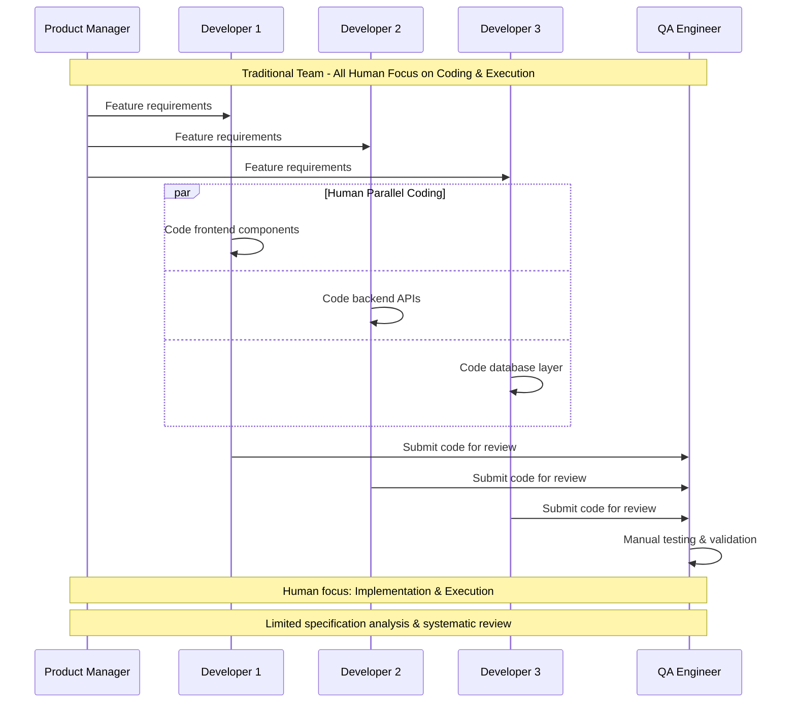
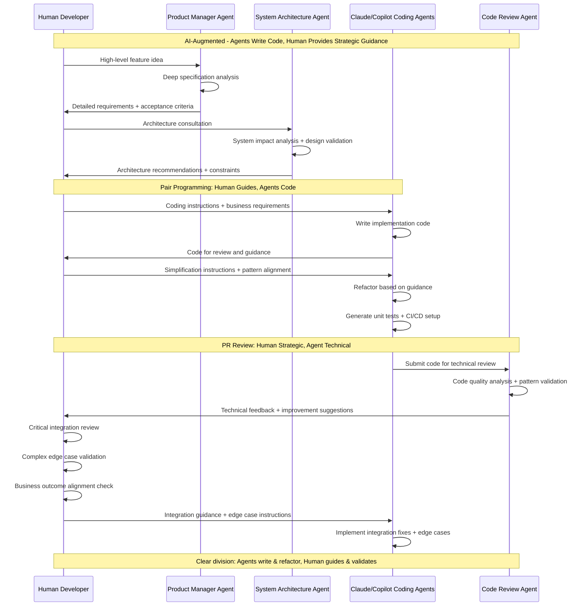
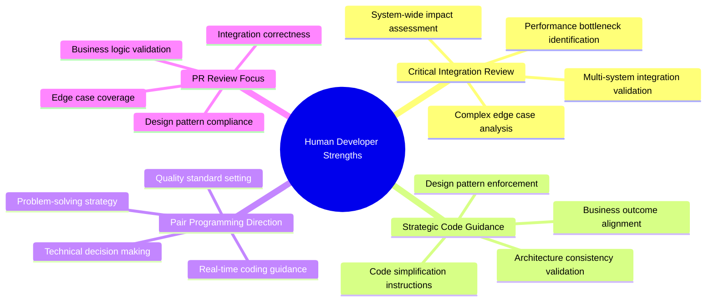
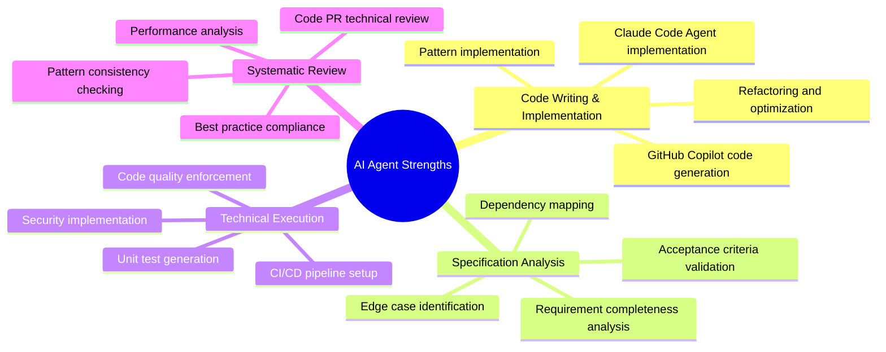
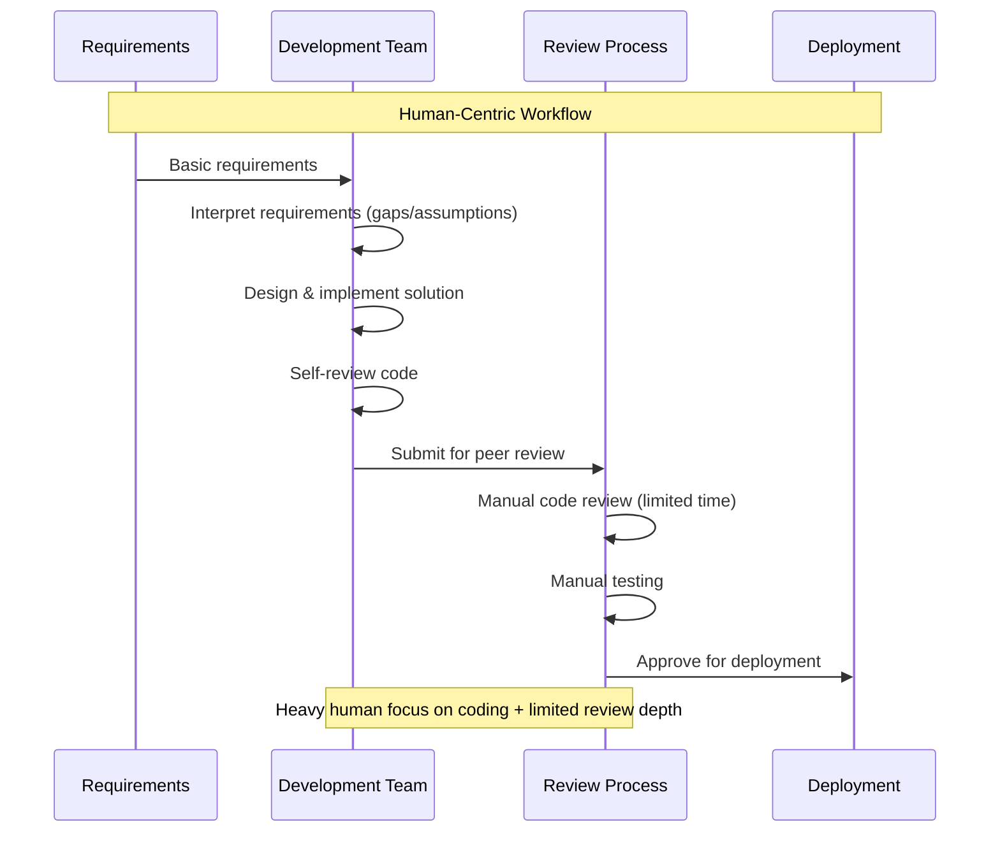
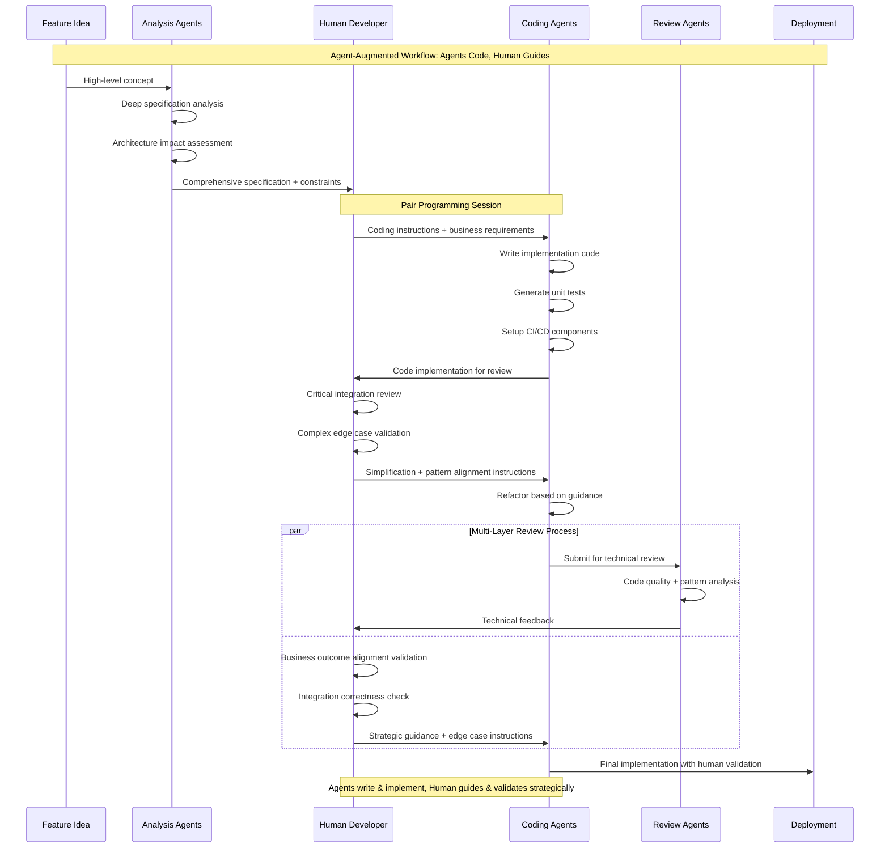
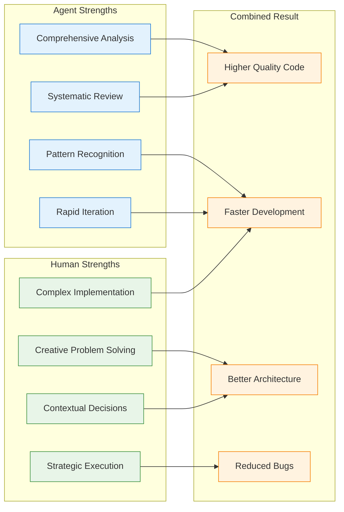

# Agent Focus vs Human Focus: Specification & Review vs Coding & Execution

> **Key Insight**: AI agents excel at specification analysis and code review, while humans focus on coding and execution. This creates a complementary workflow where agents handle the "what" and "why" while humans handle the "how."

## Core Difference: Focus Areas

### Traditional Development Team

### AI-Augmented Development

## Detailed Focus Area Analysis

### What Humans Do Better: Strategic Review & Integration Guidance

### What AI Agents Do Better: Code Writing & Technical Execution

## Workflow Sequence Comparison

### Traditional: Human-Heavy Coding + Manual Review

### AI-Augmented: Agent Code Writing + Human Strategic Review

## Real Example from Repository

### GitHub Issue #47 - Actual Agent vs Human Focus

**Human Developer Focus:**
- Strategic architecture decisions and guidance
- Critical integration review and validation
- Complex edge case analysis and instructions
- Business outcome alignment in PR reviews
- Code simplification and design pattern enforcement

**Agent Focus Areas:**
1. **Product Manager Advisor Agent**:
   - Analyzed requirement completeness
   - Generated detailed issue templates and acceptance criteria
   - Mapped dependencies and workflow impacts

2. **Claude/GitHub Copilot Coding Agents**:
   - Wrote implementation code based on human instructions
   - Generated comprehensive unit tests
   - Handled refactoring and code optimization
   - Set up CI/CD pipeline components

3. **Code Review Agent**:
   - Performed technical PR review analysis
   - Identified code quality and pattern issues
   - Suggested performance optimizations
   - Validated best practice compliance

4. **System Architecture Reviewer Agent**:
   - Validated architectural approach alignment
   - Assessed system-wide integration impacts
   - Recommended implementation patterns

## The Complementary Advantage

### Why This Division Works

### Evidence from Repository Patterns

**Agent Activities Observed:**
- Specification analysis and requirement refinement
- **Code implementation and refactoring** (Claude/Copilot agents)
- **Unit test generation and CI/CD setup**
- Multi-perspective technical PR review with detailed feedback
- Cross-platform documentation synchronization
- Architecture impact assessment and recommendations

**Human Activities Observed:**
- **Pair programming guidance and code direction**
- **Critical integration review and validation**
- **Complex edge case analysis and instructions**
- **Business outcome alignment in PR reviews**
- **Code simplification and design pattern enforcement**
- Strategic architecture decisions and final approval
- Production deployment coordination

## Key Insight: Complementary, Not Replacement

The breakthrough isn't replacing humans with AI, but **optimizing focus areas**:

- **Agents excel**: Code writing, systematic analysis, comprehensive technical review, pattern implementation
- **Humans excel**: Strategic guidance, critical integration validation, complex edge case analysis, business alignment
- **Together**: Higher quality code with faster iteration through specialized pair programming

This creates a **force multiplication effect** where each participant focuses on their strengths, resulting in better outcomes than either could achieve alone.

---

*This analysis is based on actual development patterns observed in the Loan Defenders repository, focusing on the real division of labor between AI agents and human developers rather than theoretical comparisons.*