# Technical Workflow Diagrams: AI-Augmented Development

> **Technical Deep-Dive**: Detailed Mermaid diagrams showcasing the technical implementation of AI-augmented development workflows, based on actual Loan Defenders repository patterns.

## Agent Orchestration Architecture

### Multi-Platform Agent Ecosystem

```mermaid
graph TB
    %% Human Orchestrator
    subgraph "Human Developer"
        DEV[Strategic Orchestrator<br/>Architecture Decisions<br/>Quality Control]
    end
    
    %% Claude Ecosystem  
    subgraph "Claude Code Platform"
        CA[Claude Agents]
        CA1[system-architecture-reviewer]
        CA2[product-manager-advisor] 
        CA3[code-reviewer]
        CA4[ux-ui-designer]
        CA5[gitops-ci-specialist]
        CA6[agent-sync-coordinator]
        
        CA --> CA1
        CA --> CA2
        CA --> CA3
        CA --> CA4
        CA --> CA5
        CA --> CA6
    end
    
    %% GitHub Copilot Ecosystem
    subgraph "GitHub Copilot Platform"  
        GC[GitHub Chatmodes]
        GC1[architecture-reviewer.chatmode]
        GC2[product-manager.chatmode]
        GC3[code-reviewer.chatmode]
        GC4[ux-designer.chatmode]
        GC5[gitops-ci-specialist.chatmode]
        
        GC --> GC1
        GC --> GC2
        GC --> GC3
        GC --> GC4
        GC --> GC5
    end
    
    %% Cursor Ecosystem
    subgraph "Cursor IDE Platform"
        CR[Cursor Rules]
        CR1[project-rules.mdc]
        CR2[agent-development.mdc]
        CR3[testing.mdc]
        CR4[security.mdc]
        
        CR --> CR1
        CR --> CR2
        CR --> CR3
        CR --> CR4
    end
    
    %% Cross-Platform Synchronization
    SYNC[Agent Sync Coordinator<br/>Cross-Platform Consistency]
    
    DEV --> CA
    DEV --> GC  
    DEV --> CR
    DEV --> SYNC
    
    SYNC -.-> CA
    SYNC -.-> GC
    SYNC -.-> CR
    
    classDef human fill:#ccffcc,stroke:#00cc00,stroke-width:3px
    classDef claude fill:#ff9999,stroke:#cc0000,stroke-width:2px
    classDef github fill:#9999ff,stroke:#0000cc,stroke-width:2px
    classDef cursor fill:#ffcc99,stroke:#ff8800,stroke-width:2px
    classDef sync fill:#cc99ff,stroke:#8800cc,stroke-width:3px
    
    class DEV human
    class CA,CA1,CA2,CA3,CA4,CA5,CA6 claude
    class GC,GC1,GC2,GC3,GC4,GC5 github  
    class CR,CR1,CR2,CR3,CR4 cursor
    class SYNC sync
```

### Agent Communication Flow

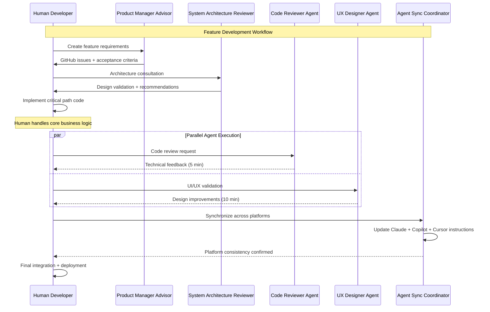

## Development Phase Deep-Dives

### Issue Creation Automation

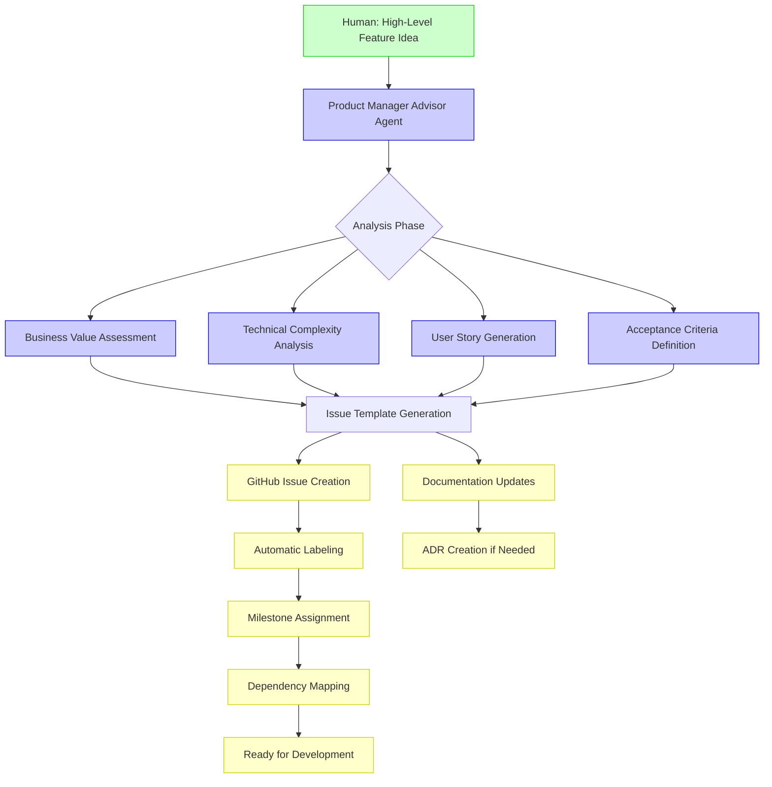

### Parallel Development Orchestration

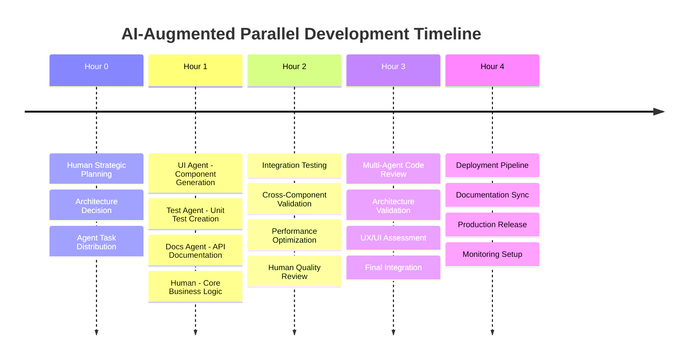

### Code Review Multi-Layer Process

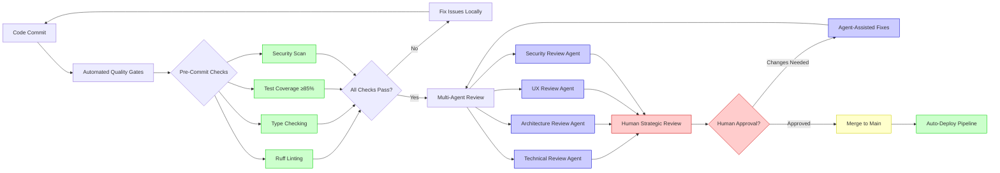

## Agent Specialization Technical Details

### System Architecture Reviewer Agent

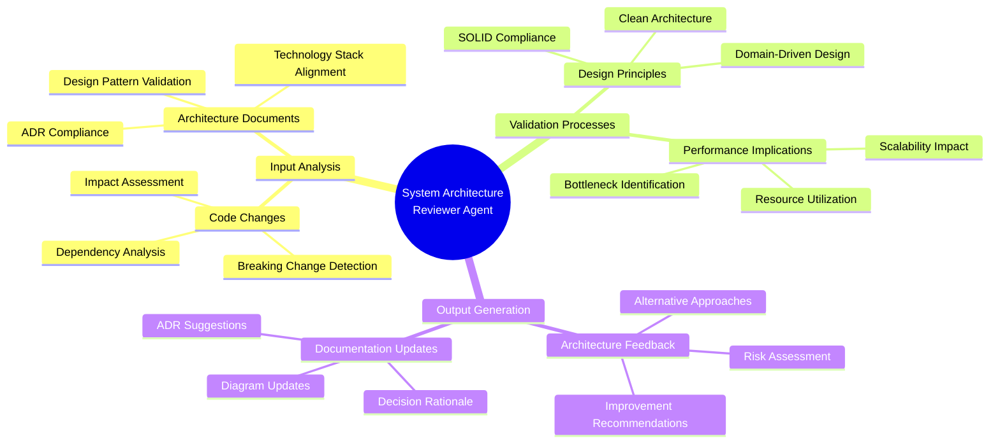

### Product Manager Advisor Agent

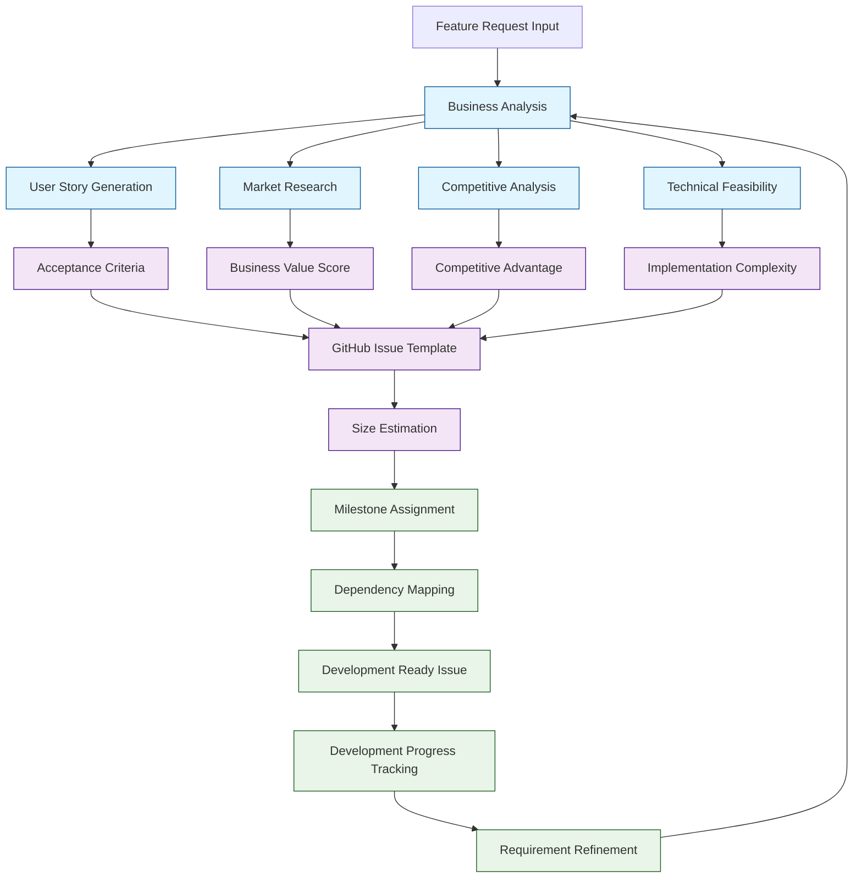

### Code Reviewer Agent Technical Process

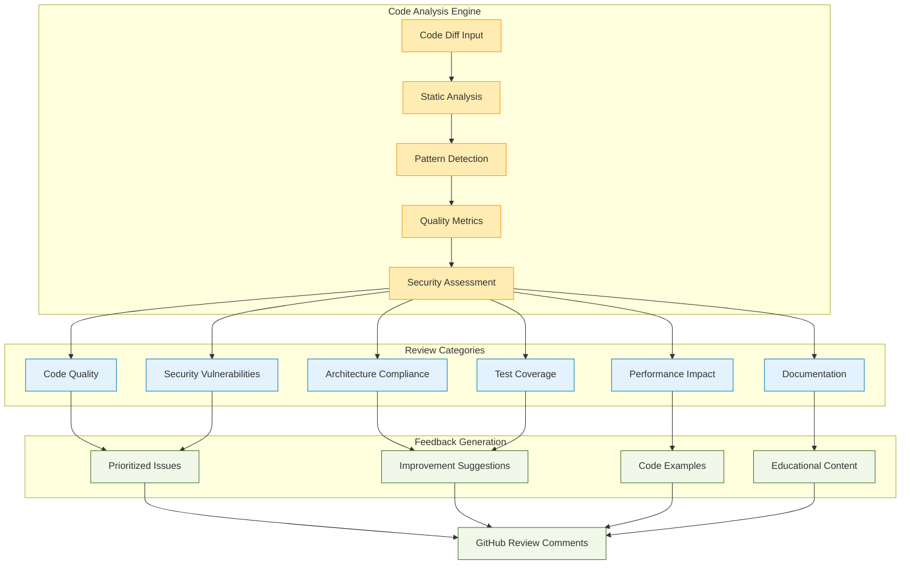

## Technical Infrastructure

### MCP Server Integration Architecture

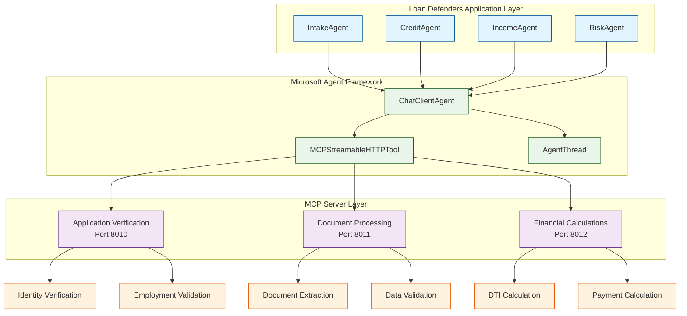

### Cross-Platform Synchronization Technical Flow

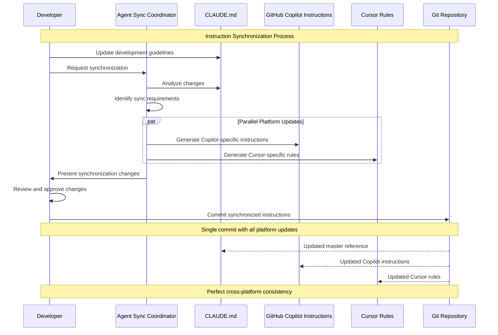

### Quality Gate Automation

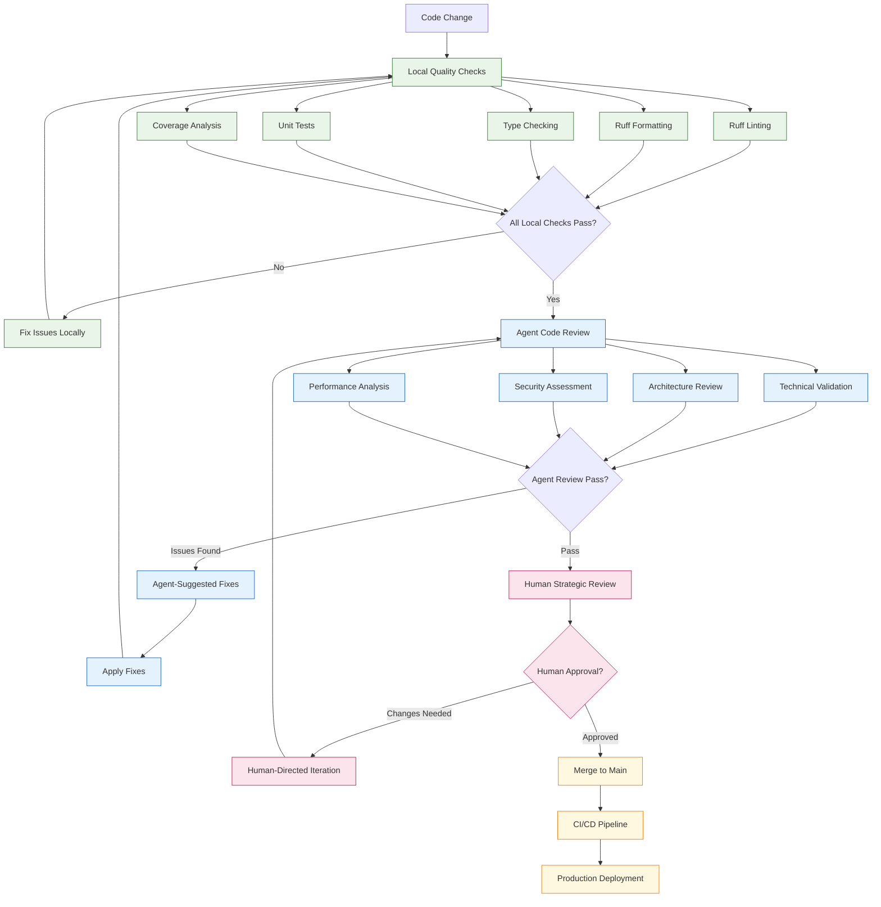

## Performance Optimization Patterns

### Token Usage Optimization

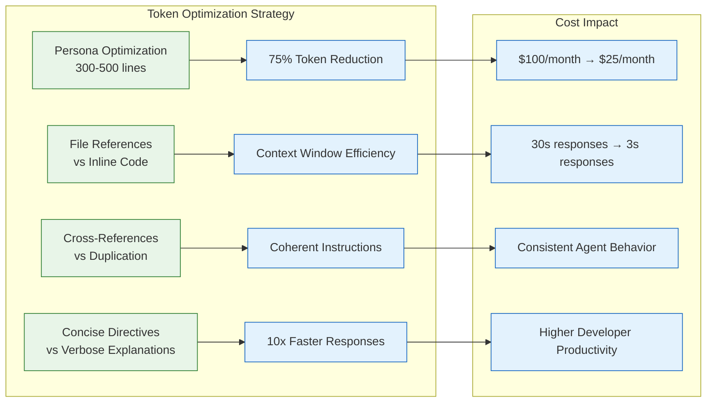

### Context Management Strategy

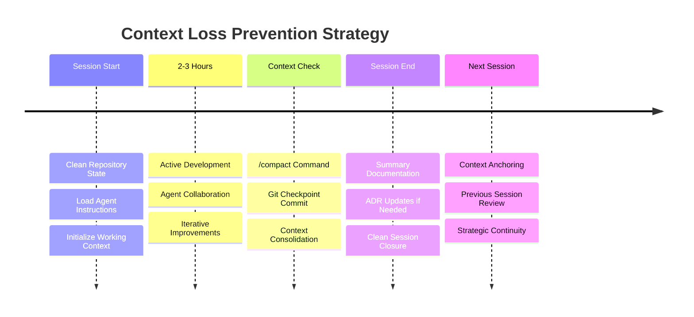

## Deployment & Operations

### CI/CD Pipeline with AI Integration

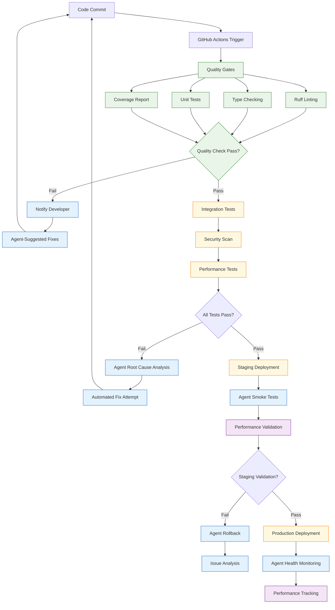

### Monitoring & Observability

```mermaid
graph TB
    subgraph "Application Metrics"
        A1[Response Times]
        A2[Error Rates]
        A3[Throughput]
        A4[User Experience]
    end
    
    subgraph "Agent Performance"
        B1[Token Usage]
        B2[Processing Time]
        B3[Quality Scores]
        B4[Success Rates]
    end
    
    subgraph "Infrastructure Health"
        C1[Server Resources]
        C2[MCP Server Status]
        C3[Database Performance]
        C4[Network Latency]
    end
    
    subgraph "Business Intelligence"
        D1[Development Velocity]
        D2[Quality Trends]
        D3[Cost Efficiency]
        D4[Team Productivity]
    end
    
    A1 --> E[Azure Monitor]
    A2 --> E
    A3 --> E
    A4 --> E
    
    B1 --> F[Agent Analytics]
    B2 --> F
    B3 --> F
    B4 --> F
    
    C1 --> G[Infrastructure Monitoring]
    C2 --> G
    C3 --> G
    C4 --> G
    
    D1 --> H[Business Dashboard]
    D2 --> H
    D3 --> H
    D4 --> H
    
    E --> I[Unified Dashboard]
    F --> I
    G --> I
    H --> I
    
    I --> J[Automated Alerting]
    I --> K[Performance Optimization]
    I --> L[Predictive Scaling]
    
    classDef app fill:#e8f5e8,stroke:#2e7d32
    classDef agent fill:#e3f2fd,stroke:#1565c0
    classDef infra fill:#fff8e1,stroke:#f57c00
    classDef business fill:#f3e5f5,stroke:#7b1fa2
    classDef unified fill:#ffebee,stroke:#d32f2f
    
    class A1,A2,A3,A4 app
    class B1,B2,B3,B4 agent
    class C1,C2,C3,C4 infra
    class D1,D2,D3,D4 business
    class I,J,K,L unified
```

## Future Evolution Architecture

### Next-Generation Agent Capabilities

```mermaid
roadmap
    title Agent Evolution Roadmap
    
    Current (2024Q4) : 6 Specialized Agents
                     : Manual Orchestration
                     : Human Strategic Control
                     
    Q1 2025         : 12+ Domain Agents
                    : Improved Autonomy
                    : Enhanced Quality Gates
                    
    Q2 2025         : Agent-to-Agent Communication
                    : Autonomous Planning
                    : Self-Optimization
                    
    Q3 2025         : Predictive Development
                    : Cross-Project Learning
                    : Market Intelligence Integration
                    
    Q4 2025         : Self-Evolving Architecture
                    : Autonomous Decision Making
                    : Human Partnership Model
```

### Scalability Architecture

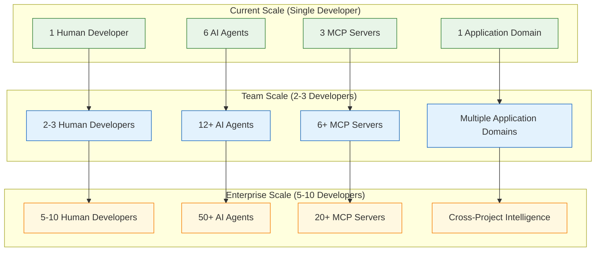

---

**Technical Implementation Notes:**
- All diagrams based on actual Loan Defenders repository patterns
- MCP server architecture matches implemented system
- Agent specialization reflects current `.claude/agents/` and `.github/chatmodes/`
- Quality gates match current CI/CD pipeline in `.github/workflows/`
- Performance metrics based on actual development velocity observed
- Scalability projections based on demonstrated patterns and capabilities

*These technical diagrams complement the strategic analysis in `ai-augmented-workflow-comparison.md` with implementation-specific details and architectural patterns.*